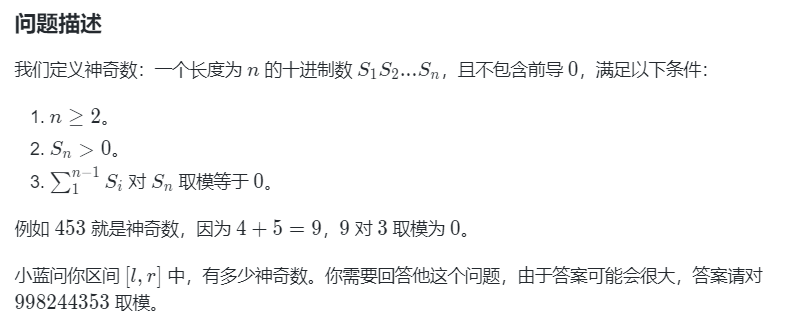
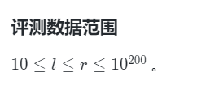

# 算法


## 还需要补充的东西

- 区间gcd，如果固定住一个端点，不断往一个方向走，然后其实是一个递降，每一段的区间的gcd都是相同的

  > [K-硝基甲苯之魇_2025牛客寒假算法基础集训营1](https://ac.nowcoder.com/acm/contest/95323/K)：基础课上的


- 查表法	


## 15届j b国赛

- **题目难度不一定按顺序的，感觉不对劲，一定要跳**

- **如果感觉分值很小的题，但是题目却特别不对劲，感觉正解很难做的时候，这时候最好是敲上暴力**

  > 真的服了，编程第2题，暴力解应该是过不了的，但是却过了


- 质因数分解，不要忘记剩下还有一点

  > 测试用例
  >
  > $15=3*5$
  >
  > $17$
  >
  > > 最后一部分剩下的一个质因数
  >
  > $24=2^3*3$
  >
  > > **次数>1的一定要测试下**
  > >
  > > 之前这里没测试到，然后错了
  >
  > $27=3^3$


## 14 J B国

- 互质，是否包括1

- 填空题一定要带脑子

  - 可能存在规律，每段区间就重复一次

- BigInteger关于质数的用法

- 正则再次复习

  > 怎么匹配的
  >
  > 具体的匹配规则

- 状压

  - 初始化
    - 大小
    - 数组

- 难度根本不是按顺序的

- 最后的时候检查下数据范围

- 滑动窗口复习

- 树的各种定义：高度


## 13 J B国（2022）

> 这个卷子在蓝桥杯云课上面真的是乱七八糟，错字一堆，格式有问题，题目也有问题，很多题都对不上，时间空间限制也有问题
> 这份卷子也做的不咋样，可以不参考这个
> 后续做真题，最好就是看时间的PDF
>
> 蓝桥杯OJ上为50，实际上由于一题不一样但是做对了，应该是65。
> 然后还有一题背包问题实际逻辑都没错，没用滚动数组优化，开个数组就超时了，但是这里卷子上有3s，OJ上只有1s，实际应该是能过的，所以应该是85分
>
> 这里填空题都错了

[6.迷宫 - 蓝桥云课](https://www.lanqiao.cn/problems/2222/learning/?page=1&first_category_id=1&second_category_id=3&name=迷宫&tag_relation=intersection)

[2.数数 - 蓝桥云课](https://www.lanqiao.cn/problems/2218/learning/?page=1&first_category_id=1&second_category_id=3&name=数数&tag_relation=intersection)


- 进制转换复习下


- A2：只需最后一个答案的


- 一定要测试
  多输出看看，是否跟自己想的是一样的


- 这份卷子特别乱
  题目的序列都是错误的
- 后续做题，直接看pdf做


**小球称重**

- 一定要认真读题
- 求交并补
- 数组转为链表


```java
		Integer[] tmp;//不能是int，类型必须要对应
		tmp= new Integer[]{1,2,3,4,5,6};
		Set<Integer> a=new TreeSet<Integer>(Arrays.asList(tmp));
		tmp= new Integer[]{4,5,6,7,8,9};
		Set<Integer> b=new TreeSet<Integer>(Arrays.asList(tmp));
		System.out.println(a.retainAll(b));
		System.out.println(a);
```


背包问题

- 注意了：不选但是`w[i]`过大，不选的时候一定要赋值，就是状态转移的条件
- 搞个样例
- 背包问题最好搞个滚动优化


- DP问题状态计算时一定要仔细想想条件，初始化


DP

- 仔细考虑i,j等于0的时候


- 后续数组一律使用动态赋值，特别是dp问题


## 14 C B国

> 考试前的最后一份了
>
> 就拿了58分，有一题思路是对的，但是不知道为什么用java的栈会超时，换了种写法就过了，应该是68分
>
> 题目挺难的，很多题来不及想正解，只能直接写暴力
>
> 这个做的不太好，这里应该要能拿80左右的分


- 等一下复习java哪些举出语法

- 1不是质数

- 判断质因数的最后一个条件

- 比较字符串大小


A:DP

做过一次了，就是找子序列的dp

B:唯一分解定理+质因数分解

需要看出是完全平方数，能够简单很多，填空题也是要动脑子的

C:排序+思维

模拟，想明白了就简单

D:贪心+双指针

> 这里我的栈写法不知到为什么会超时，实际思路是一样的
>
> 后续都能用的时候还是用双指针吧，复杂度低

E:哈希+枚举+计算几何中的点线

> 这里我直接暴力了，拿了快一半的分
>
> 这里是想到了正解的写法，但是感觉还有不少细节需要解决，但是感觉需要时间所以先跳过了，后续回来就敲了个暴力了

> 正解就是枚举顶点就完事了，这里需要哈希处理边，遍历边相同的，特判下贡献
>
> > 一开始想的是可能会超时，结果是不会超的
> >
> > 对蓝桥杯感觉可行，但是复杂度感觉很危险的时候，也可以试试，很多时候都能过
> >
> > 真服了

F:无向图的tarjan求割边

> 没写出来，一个月前刚学完，呜呜
>
> 这题主要的问题就是模板没记熟，漏了一句，唉，不然能过90%

7G:思维+bfs+进制技巧

> 这题做出来了，我这里用的是进制的技巧，这样会简单特别多
>
> **==这题建议整理下==**

8H:思维

> 没做出来，而且耗了很久
>
> 这题看着感觉不难，但是想了半天都没有搞出来
>
> 主要考思维，唉，代码特别简单
>
> 靠，思维还是不行呀，唉，只能多模拟了
>
> **注意题目的所有信息，这里最关键的信息藏在了数据范围那里**
>
> 

9I

> 暴力+高进度能骗一半的分
>
> 正解不太可能做出来，跳过

10J:

> 来不及看题

## TODO 算法待看


### 滑动窗口

[掌握滑动窗口本质，秒杀相关题型_哔哩哔哩_bilibili](https://www.bilibili.com/video/BV1GAV7zHEWD/?spm_id_from=333.788.recommend_more_video.0&vd_source=79043f2a8efe4672df69e4818fe876b8)


### 他人的经验


- 比赛心态特别重要，有不会的直接跳过

## 蓝桥云课

> 没做的题后面的会打乱，这里大部分题后续可能是需要一块做的
>
> 然后这里有些题文档里有或者需要整理会写在前面

> 加粗表示需要整理


> 前三章发现，看题目你下子其实就知道属于哪个算法分区了，进行题目汇总意义不大
>
> - **后续把通过题目能够明显看出题目的以及文档提到的题都先做完，后面再汇总**


### 02-数论

> 文档还需要再次整理

> 就是这里个人感觉文档里的写得不好，可以在看看基础课的，基础课的模板比较好写

> 能掌握就掌握，这个章节感觉难就先跳

- 质数相关，剩下的不要忘记了

  > 可以测试像`3*3*7`这样的样例

知识点汇总：

- 筛素数

- 欧拉函数

  - 求某个数的欧拉函数
  - 筛法求`[1,n]`的欧拉函数

- **欧拉定理**

  > 此块第一次遇见，需要整理，有点意思
  >
  > 证明在ds中，这里格式有点问题，后续直接找就行

  - 费马定理(欧拉定理的特例)

  - 欧拉定理

  - 欧拉定理推论（欧拉降幂）

    > 例题：后续做
    >
    > [02023次方 - 蓝桥云课](https://www.lanqiao.cn/problems/17095/learning/)

> **欧拉定理的简单证明步骤**
>
> ---
>
> ### **定理陈述**
>
> 如果正整数 $a$ 和 $n$ 互质（即 $\gcd(a, n) = 1$），则：  
> $$
> a^{\phi(n)} \equiv 1 \mod n
> $$
> 其中 $\phi(n)$ 是欧拉函数，表示小于 $n$ 且与 $n$ 互质的正整数的个数。
>
> ---
>
> ### **证明过程**
>
> #### **步骤1：构造互质数的集合**
> 设所有小于 $n$ 且与 $n$ 互质的数为：  
> $$
> S = \{r_1, r_2, \dots, r_{\phi(n)}\}
> $$
> 例如，若 $n = 7$，则 $S = \{1, 2, 3, 4, 5, 6\}$，且 $\phi(7) = 6$。
>
> ---
>
> #### **步骤2：乘以 $a$ 得到新集合**
> 将集合 $S$ 中的每个数都乘以 $a$，得到新集合：  
> $$
> S' = \{a \cdot r_1, a \cdot r_2, \dots, a \cdot r_{\phi(n)}\}
> $$
> 例如，若 $a = 3$ 且 $n = 7$，则 $S' = \{3, 6, 9, 12, 15, 18\}$。
>
> ---
>
> #### **步骤3：新集合在模 $n$ 下是原集合的排列**
> - **唯一性**：若 $a \cdot r_i \equiv a \cdot r_j \mod n$，由于 $a$ 与 $n$ 互质，可两边约去 $a$，得 $r_i \equiv r_j \mod n$。但 $r_i$ 和 $r_j$ 均小于 $n$，故必须 $r_i = r_j$，即 $i = j$。因此，$S'$ 中的元素在模 $n$ 下两两不同。
> - **覆盖性**：每个 $a \cdot r_i \mod n$ 仍与 $n$ 互质（因为 $a$ 和 $r_i$ 均与 $n$ 互质），所以 $S'$ 是 $S$ 的一个排列。
>
> ---
>
> #### **步骤4：比较集合的乘积**
> 原集合 $S$ 的乘积为：  
> $$
> P = r_1 \cdot r_2 \cdot \dots \cdot r_{\phi(n)}
> $$
> 新集合 $S'$ 的乘积为：  
> $$
> P' = (a \cdot r_1) \cdot (a \cdot r_2) \cdot \dots \cdot (a \cdot r_{\phi(n)}) = a^{\phi(n)} \cdot P
> $$
> 由于 $S'$ 是 $S$ 的排列，两者在模 $n$ 下的乘积相等：  
> $$
> a^{\phi(n)} \cdot P \equiv P \mod n
> $$
>
> ---
>
> #### **步骤5：约去 $P$**
> 由于 $P$ 是多个与 $n$ 互质的数的乘积，$P$ 也与 $n$ 互质，因此存在 $P$ 的模 $n$ 逆元 $P^{-1}$。两边同时乘以 $P^{-1}$：  
> $$
> a^{\phi(n)} \equiv 1 \mod n
> $$
>
> ---
>
> ### **例子验证**
> 取 $n = 7$（质数，$\phi(7) = 6$），$a = 3$（与7互质）：  
> 1. 原集合 $S = \{1, 2, 3, 4, 5, 6\}$，乘积 $P = 720$。  
> 2. 新集合 $S' = \{3, 6, 9, 12, 15, 18\}$，模7后为 $\{3, 6, 2, 5, 1, 4\}$，乘积 $P' = 3 \cdot 6 \cdot 2 \cdot 5 \cdot 1 \cdot 4 = 720$。  
> 3. 比较乘积：  
>    $$
>    3^6 \cdot 720 \equiv 720 \mod 7 \implies 3^6 \equiv 1 \mod 7
>    $$
>    实际计算 $3^6 = 729 \equiv 1 \mod 7$，验证成立。
>
> ---
>
> ### **总结**
> 欧拉定理的核心在于：
> 1. 构造与 $n$ 互质的数的集合，并利用其唯一性。
> 2. 通过乘积的等价性导出指数关系。
> 3. 最终利用模逆元约去公共因子，得到 $a^{\phi(n)} \equiv 1 \mod n$。
>
> $$
> \boxed{a^{\phi(n)} \equiv 1 \mod n}
> $$
>
>
> 

> 拓展欧拉定理的证明，涉及到中国剩余定理，看了好久都看不懂，建议这里直接跳过


- 逆元

  > 例题：后续做
  >
  > [0乘法逆元 - 蓝桥云课](https://www.lanqiao.cn/problems/1157/learning/)

- 大组合树

  - 动态规划递推出来

  - **带模的，用数学公式求逆元**

    > 有模板，结合acwing的
    >
    > > 这里逆元的用法之前没见过，这个可以学
    >
    > ```c++
    > void init() 
    > {
    >     fc[0] = 1;
    >     for (int i = 1; i < lim; ++i)
    >         fc[i] = 1ll * fc[i - 1] * i % MOD;
    >     rfc[lim - 1] = qp(fc[lim - 1]);
    >     for (int i = lim - 1; i > 0; --i)
    >         rfc[i - 1] = 1ll * rfc[i] * i % MOD;
    > }
    > ```
    >
    > > `c[i]`其实表示为`A!`，带个`r`表示逆元
    > >
    > > 乘逆元直接看成除逆元（当然不能直接除），其他的运算法则都是一样的
    > > **逻辑上的式子都是一样的，直接用就好了，但是只需要转化除法就行**

- 容斥定理

  > 就是用二进制枚举，然后看1的个数，决定符号

- **简单多项式**

  > 新东西需要整理

  - 多项式乘法

    > 但是其实感觉暴力的时间复杂度，也不咋地，优化做法太难了，可以直接跳过

    - 组合问题转换为多项式乘法

      > 看次数，这里感觉会不会用dp更好

      - **生成函数**

        > [0生成树问题 - 蓝桥云课](https://www.lanqiao.cn/problems/20142/learning/)
        >
        > > 会暴力做法就行，过60%，这个本来就是研究生组的，不是我一定要会的


题目汇总：

[16届蓝桥杯14天国特冲刺营 - 最小质因子之和 - 蓝桥云课](https://www.lanqiao.cn/courses/51805/learning/?id=4071532&compatibility=false)
[16届蓝桥杯14天国特冲刺营 - 最小质因子之和（难） - 蓝桥云课](https://www.lanqiao.cn/courses/51805/learning/?id=4084021&compatibility=false)
[16届蓝桥杯14天国特冲刺营 - 乘法逆元 - 蓝桥云课](https://www.lanqiao.cn/courses/51805/learning/?id=4071533&compatibility=false)
[16届蓝桥杯14天国特冲刺营 - 欧拉降幂 - 蓝桥云课](https://www.lanqiao.cn/courses/51805/learning/?id=4071534&compatibility=false)
[16届蓝桥杯14天国特冲刺营 - 求解组合数 - 蓝桥云课](https://www.lanqiao.cn/courses/51805/learning/?id=4071535&compatibility=false)
[16届蓝桥杯14天国特冲刺营 - X质数 - 蓝桥云课](https://www.lanqiao.cn/courses/51805/learning/?id=4071536&compatibility=false)
[16届蓝桥杯14天国特冲刺营 - 欧拉函数 - 蓝桥云课](https://www.lanqiao.cn/courses/51805/learning/?id=4071538&compatibility=false)
[16届蓝桥杯14天国特冲刺营 - 生成树问题 - 蓝桥云课](https://www.lanqiao.cn/courses/51805/learning/?id=4071537&compatibility=false)
[16届蓝桥杯14天国特冲刺营 - 2的2023次方 - 蓝桥云课](https://www.lanqiao.cn/courses/51805/learning/?id=4084022&compatibility=false)


### 04-数位dp


#### 网页

[16届蓝桥杯14天国特冲刺营 - 精讲文档 - 蓝桥云课](https://www.lanqiao.cn/courses/51805/learning/?id=4071522&compatibility=false)

[0谁是帕鲁？【算法赛】 - 蓝桥云课](https://www.lanqiao.cn/problems/16984/learning/)

[2376. 统计特殊整数 - 力扣（LeetCode）](https://leetcode.cn/problems/count-special-integers/solutions/1746956/shu-wei-dp-mo-ban-by-endlesscheng-xtgx/)

[2376. 统计特殊整数 - 力扣（LeetCode）](https://leetcode.cn/problems/count-special-integers/description/)

[AcWing 338. 用提高课的方式打开基础课acwing338计数问题 - AcWing](https://www.acwing.com/solution/content/4934/)


> 哇敲，想不到这里是新课

> 感觉蓝桥杯给的那个模板，也不是特别好用，所以这里看题解的时候，发现了别人了模板，这里学是这个
>
> 这里结合着来吧，变成适合自己的

> 注意了，这里一定要记忆化搜索，不然很可能会超时

> **后续需要结合蓝桥杯云课的整理下，因为这里的数位dp其实是我第一次学**

[2376. 统计特殊整数 - 力扣（LeetCode）](https://leetcode.cn/problems/count-special-integers/solutions/1746956/shu-wei-dp-mo-ban-by-endlesscheng-xtgx/)

> 这个就是模板

> 从这题开始学
>
> 后续再慢慢尝试用这个模板
>
> 现在感觉这个模板关于记忆化搜索那边还不具有普适性
>
> 这里还需要点数位dp的设计，不然很容易不断重复搜索同一个状态，导致超时
>
> 这里发现不能直接套数位dp，这里感觉其实更像是一个逆过程，这里后续是需要想清楚的
> **看看这里表示出这个状态数组**

> 分解成多个更小的问题，

> 这个模板确定能够涵盖数位dp的很多情况


> 直接被模板

> - 这里关于模板，就是其实是能转换为正常的dp的，就是需要详细展开专题状态的维度
>
> - 注意:dfs和dp数组一般都是求答案或者答案的子问题的
>
>   > 一般都是放题目要的东西


> 这里感觉本质就是dp，从一个慢慢推全局，跟y总那题不一样


[0谁是帕鲁？【算法赛】 - 蓝桥云课](https://www.lanqiao.cn/problems/16984/learning/)

对于阿拉伯数字 0∼9，有些数字从图形上看是有封闭图形存在的，具体为：

| 数字 | 封闭图形数量 |
| ---- | ------------ |
| 0    | 1            |
| 1    | 0            |
| 2    | 0            |
| 3    | 0            |
| 4    | 1            |
| 5    | 0            |
| 6    | 1            |
| 7    | 0            |
| 8    | 2            |
| 9    | 1            |

请问，在区间 [L,R] 中，有多少个数恰好有 K 个封闭图形，输出该结果。

**数据范围：**$1 \le L \le R \le 10^{12},0 \le K \le 24$

-------

> 这题感觉难度一般，基本就是模板小改下就行

```java
//数位dp
	//除去模板上的那些细节，感觉最难就是要之知道存下的状态是啥（记忆化搜索记忆的是啥？返回值返回啥？）
	//接着用灵茶的模板
	//题目这个问题已经无法，再分解，但是部分题还需要再分解，然后枚举分解后的问题
import java.io.*;
import java.util.*;
import java.math.*;
import java.time.*;

public class Main {
	static final int N = (int) 30;
	static int K;
	static int[] dist= {1,0,0,0,1,0,1,0,2,1};
	static long f[][]=new long[30][30];
	static char[] s;
	static int len;
		//f[i][j]:在没有达到上限同时是数字的情况下，算到第i位，当前有j个封闭图形，最终为K个方案数
	/**
	 * 数位dp模板
	 * @param i:当前数位i
	 * @param j:当前共有j个封闭图形
	 * @param isLimit:是否还踩着上限
	 * @param isNum:是否为数字
	 * @return:当前构造到数位i，现在的封闭图形数量为j个，有多少个数能够恰有K个封闭图形
	 */
	static long dfs(int i,int j,boolean isLimit,boolean isNum) {
		if(j>K) return 0;//提前剪枝
		if(i==len) {
			if(isNum) return j==K?1:0;
			else return 0;
		}
		if(!isLimit&&isNum&&f[i][j]!=-1) {
			return f[i][j];
		}
		long res=0;
		//这个位置不填的情况（不构成数字的情况）
		if(!isNum) {
			res+=dfs(i+1,j,false,false);
		}
		//开始选数
		int up=isLimit?s[i]:9;
		for(int x=isNum?0:1;x<=up;++x) {
			res+=dfs(i+1,j+dist[x],isLimit&&x==up,true);
		}
		if(!isLimit&&isNum) {
			f[i][j]=res;
		}
		return res;
	}
	//算[1,n](含初始化)
	static long cal(String t) {
		s=t.toCharArray();
		len=s.length;
		for(int i=0;i<len;++i) s[i]-='0';
		for(long[] tmp:f)  Arrays.fill(tmp,-1);
		return dfs(0,0,true,false);
	}
	public static void main(String[] args) throws Exception {
		Scanner sc = new Scanner(System.in);
		BufferedReader br = new BufferedReader(new InputStreamReader(System.in));
		BufferedWriter bw = new BufferedWriter(new OutputStreamWriter(System.out));
		String[] ss;

		String L=Long.toString(sc.nextLong()-1),R=sc.next();//前缀和形式(L,R]
		K=sc.nextInt();
		System.out.println(cal(R)-cal(L));
		
		bw.flush();
	}
}
```

> [分块](#09-分块)：这里有更粗暴的做法


[0神奇数 - 蓝桥云课](https://www.lanqiao.cn/problems/5891/learning/)






> 题解文档：[16届蓝桥杯14天国特冲刺营 - 精讲文档 - 蓝桥云课](https://www.lanqiao.cn/courses/51805/learning/?id=4071522&compatibility=false)
>
> ==这里需要整理关于前缀和那些，大数的前缀和如何处理==

> 此题感觉在数位dp里面算比较难的

> 注意需要满足题目的条件，看看题目的条件最终都要坐落于哪里
>
> 比如这里：
>
> ```java
> 		if(i==len-1) {//注意：个位是mod
> 			if(isNum) {//构成了数字
> 				if(isLimit&&mod>s[i]) {//跟着上限走，最后一位是不能超过最高位的
> 					return 0;
> 				}else return j%mod==0?1:0;//小于上限，最后还需要能被整除
> 			}else return 0;//没有搞成数字
> 		}
> ```
>
> 


### 05-状压dp

- 一般有一个维度表示集合
- 特征还是挺明显的，数据范围挺小的，但是大部分dfs会超时


- [蒙德里安的梦想](https://www.acwing.com/activity/content/problem/content/1010/)

  > 经典题感觉还是要好好看看的
  >
  > 感觉还不是很熟悉
  
  - 这个状态表示很经典：**放好`0~i-1`列，第`i`列的状态是`j`**
  - 答案一般就是：`f[m][0]`，放好了`0~m-1`列，最后列一个不放
  


- dp一定要从递推的视角去考虑

  > 按一个顺序去推，从上到下或者从左到右


- [16届蓝桥杯14天国特冲刺营 - 羊圈 - 蓝桥云课](https://www.lanqiao.cn/courses/51805/learning/?id=4072909&compatibility=false)

  > 此题有题解


### 08-哈希


- 破环成链的技巧还是需要会的


[16届蓝桥杯14天国特冲刺营 - 团建 - 蓝桥云课](https://www.lanqiao.cn/courses/51805/learning/?id=4072910&compatibility=false)

- 我真的服了，这题其实很简单，但是我整难很多，这里其实这里儿子结点的权重互不相同，根本不需要重构树，就是说不存在相同的公共的前后缀，不会回溯。有了这个条件能够简单超级多
  你这里对另一颗树的当前的结点所有儿子的权值和结点进行下哈希，主要遍历另一棵树。
  `dfs(h,x,fx,y,fy)`:这样已经够了


### 09-分块

> 代码感觉没必要学，感觉不算很好写，简单看看就行
>
> 主要就是需要把思想学掉，把区间进行分块，一般都是分成$\sqrt{n}$最优或者只要时间复杂度允许咋分都没事

- 树状数组无论哪个操作，循环里面都是`lowbit(i)`，不是`x`

  ```java
  	static void add(int x,int d) {
  		//往后找爸爸
  		for(int i=x;i<=n;i+=lowbit(i)) {
  			tr[i]+=d;
  		}
  	}
  	static long sum(int x) {//求[1,x]的前缀和
  		//往前爬楼梯
  		long sum=0;
  		for(int i=x;i>0;i-=lowbit(i)) {
  			sum+=tr[i];
  		}
  		return sum;
  	}
  ```

  

[16届蓝桥杯14天国特冲刺营 - 精讲文档 - 蓝桥云课](https://www.lanqiao.cn/courses/51805/learning/?id=4071526&compatibility=false)
[16届蓝桥杯14天国特冲刺营 - 谁是帕鲁 - 蓝桥云课](https://www.lanqiao.cn/courses/51805/learning/?id=4072916&compatibility=false)

> 用区间分块解决这个感觉还是挺妙的
>
> 很直接很暴力，但是非常难想
>
> 能够简单特别多
>
> 可以看看，这里我没有自己敲一遍

> 题目简述：求`[l,r]`中封闭图形恰为k的数字数量，这里`l和r`能够达到`1e12`的数量级，暴力肯定不行的
>
> 稍微自己整理下思路：
>
> 这里我们可以试着分成$10^6$块（$\sqrt{n}$），这个暴力求对于一些特殊的块或者预处理都挺能够接受的。这里我们发现除了首尾的那两块可能出现放不满外，其他都是能够放满的。
>
> 那么，我们就想这里首尾块我们暴力求，中间块用看看能不能直接求。
>
> > 首位块会有边界问题需要想清楚
>
> - 对于中间块，我们需要找各个块中封闭图形恰为k的数量：
>
>   > 那么实际上每一块的最后 6 位都是从 `[000000,999999]`，这一部分信息可以合并求出。
>   >
>   > > 这里我们模拟下
>   >
>   > 其中的某一块$[a×10^6,(a+1)×10^6)$ ，块内每个数都是以`a`开头，那么对于 `[000000,999999]`都需要加上`a`的封闭图形数量`f(a)`，其中恰为k的个数，就是求 `[000000,999999]`中封闭图形数量为`k-f(a)`。
>   >
>   > 所以这里我们只需要预处理`cnt[i]`：表示在 `[000000,999999]`中封闭图形数量为i的数量


### 10-线段树

> 搞出一个测试样例出来

[16届蓝桥杯14天国特冲刺营 - 精讲文档 - 蓝桥云课](https://www.lanqiao.cn/courses/51805/learning/?id=4071527&compatibility=false)

> 概述可以看看
>
> 图也能看看，图都挺不错的

- 回忆下空间设置

- 这里查询区间和那个分区间那里还不太熟

- 懒标记认真复习下

  > 文档关于懒标记的，我感觉也挺不错的
  >
  > 延迟标记


### 11-ST表(RMQ)和LCA


ST表也需要一个测试用例


- [真题-机房](https://www.lanqiao.cn/problems/2198/learning/)：算路径上点权和，但是需要加的地方有点多，感觉其实还是挺容易错的，后面再研究下


### 12-拓扑排序与并查集


[16届蓝桥杯14天国特冲刺营 - 蓝桥部队 - 蓝桥云课](https://www.lanqiao.cn/courses/51805/learning/?id=4072945&compatibility=false)

> 推荐再做，当时做成依托了
>
> 需要模拟下，不然思维难度挺大的
>
> **==一定一定就是要模拟清楚再下手==**

> **此题需要整理**
>
> 把队列一整个当成整体，也能变成连通块，然后用带权并查集求其中序号即可

[AcWing 2069. 网络分析 - AcWing](https://www.acwing.com/activity/content/problem/content/2472/)

> 此题也需要整理，还没做
>
> 

> 对连通块加减

## 策略

- 根据场景往学过的算法去靠
- 模拟代码


- 填空题暴力的时候还是需要计算下复杂度的，可能跑不出来

  > [16届蓝桥杯14天国特冲刺营 - 01背包（划分权重） - 蓝桥云课](https://www.lanqiao.cn/courses/51805/learning/?id=4071544&compatibility=false)
  >
  > 这里我们用选和不选的dfs模型，大概$2^{40}$的复杂度，跑到比赛结束都跑不出来


- 题目给你多个条件的时候，能过感觉一口气满足这么多条件很难，那么这时候我们可以自己固定某个条件来枚举，这样能够简单很多

  > [16届蓝桥杯14天国特冲刺营 - 神奇数 - 蓝桥云课](https://www.lanqiao.cn/courses/51805/learning/?id=4072900&compatibility=false)
  > 这里固定最后一个数

## debug

> 最好就是不要改变数据范围：
>
> **改变了数据范围记得还原**


==TODO==：其实还没有改完，有三个样例点过不去

[P12347 [蓝桥杯 2025 省 A 第二场\] 栈与乘积 - 洛谷](https://www.luogu.com.cn/problem/solution/P12347)


乘法不取模的情况：

- **乘0：全为0**
- 乘1：不变，相当于不取
- 其他：
  - 溢出：遇到0的时候要小心，还为0

> 题解中有一种做法很妙，就是特殊处理0，1的，其他的最多取32次就会溢出


```java
//	static long INF=(1<<32);//这样是错的
	static long INF=(1L<<32);
```


[(1 封私信) 你最满意的10款 PC 软件是什么？ - 知乎](https://www.zhihu.com/question/469450888/answer/3217769558)


# -------------

# 网页待看


[(1 封私信) 计算机大三不会做项目正常吗？ - 知乎](https://www.zhihu.com/question/615351166/answer/34470026800)
[独立开发者都使用了哪些技术栈？ - 知乎](https://www.zhihu.com/question/582771512)
[为什么部分人友善且独来独往？ - 知乎](https://www.zhihu.com/question/26398755/answer/126265324)
[为什么越长大越觉得交不到那种可以交心的朋友？ - 知乎](https://www.zhihu.com/question/35547426)

[PR_curve yolo放的是测试集还是训练集 - 搜索](https://cn.bing.com/search?form=bing&q=PR_curve yolo放的是测试集还是训练集)
[YOLOv5系列(五十一) 解读训练结果混淆矩阵， PR曲线，AP， mAP， F1-score，events.out.tfevents，P_curve.png，PR_curve.png等_yolo pr曲线-CSDN博客](https://blog.csdn.net/weixin_44302770/article/details/134998078)
[【机器学习-14】K-means聚类算法：原理、应用与优化_改成随机化初始聚类中心-CSDN博客](https://blog.csdn.net/qq_38614074/article/details/137456095)
[深度解析 | 二元Logistic回归模型（单因素筛查、软件操作及结果解读）_单因素logistic回归分析-CSDN博客](https://blog.csdn.net/m0_37228052/article/details/142105323)
[一文理解二元logistic回归_or接近1-CSDN博客](https://blog.csdn.net/m0_37228052/article/details/108074125)
[logistic回归_百度百科](https://baike.baidu.com/item/logistic回归/2981575)


[(1 封私信) 保研的过程真的很累吗？ - 知乎](https://www.zhihu.com/question/655845654)
[(1 封私信) 保研时老师会喜欢科研经历多但学分绩不高的学生吗? - 知乎](https://www.zhihu.com/question/601069293)
[(1 封私信) 处在保研边缘的人是怎么挺住的？ - 知乎](https://www.zhihu.com/question/63735936/answer/1620367099)
[24双非计算机保研/推免记录（附面经） - 知乎](https://zhuanlan.zhihu.com/p/659149972)
[(1 封私信) 学计算机的各位能告诉我你们的经历吗？ - 知乎](https://www.zhihu.com/question/603689476/answer/104512646255)
[对保研一无所知，保研小白该如何从零开始？ - 知乎](https://zhuanlan.zhihu.com/p/29917987716)
[人最核心的能力是什么？ - 知乎](https://www.zhihu.com/question/662211972/answer/127116923086)
[(1 封私信) 感觉自己是废物 - 搜索结果 - 知乎](https://www.zhihu.com/search?q=感觉自己是废物&search_source=Suggestion&utm_content=search_suggestion&type=content)
[(1 封私信) 程序员的悲哀是什么？ - 知乎](https://www.zhihu.com/question/399148081/answer/123835800215)
[(1 封私信) 科研工作者有哪些「新手常见错误」？ - 知乎](https://www.zhihu.com/question/340495864/answer/827296059)


[(1 封私信) 为什么本科学历就已经超越了 95% 的国人，本科生还活的那么难？ - 知乎](https://www.zhihu.com/question/381636100/answer/1120386056)
[(1 封私信) 大学生学java很有挫败感怎么办？ - 知乎](https://www.zhihu.com/question/637930349/answer/3398987932)
[(1 封私信) 学计算机的各位能告诉我你们的经历吗？ - 知乎](https://www.zhihu.com/question/603689476/answer/3590968927)
[边际效应_百度百科](https://baike.baidu.com/item/边际效应/555439)
[(1 封私信) 大学的真相是什么？ - 知乎](https://www.zhihu.com/question/622975242/answer/13266685258)

硕士相关：
[(1 封私信) 现在读研的红利还剩多少？ - 知乎](https://www.zhihu.com/question/456374240)
[现在 985 计算机类硕士也会失业了吗？学这行已经完全没前途了吗？ - 知乎](https://www.zhihu.com/question/566435994)
[(1 封私信) 能不能讲讲985研究生毕业计算机就业情况，打破信息隔阂? - 知乎](https://www.zhihu.com/question/610504075)


[(1 封私信) 无趣的本质是什么？ - 知乎](https://www.zhihu.com/question/620391012)
[胜率百分百的猜拳机器人！盘点我做的10个最酷装置【 Mark Rober官方】_哔哩哔哩_bilibili](https://www.bilibili.com/video/BV1emFPe4E6u/?spm_id_from=333.1007.tianma.2-1-3.click&vd_source=79043f2a8efe4672df69e4818fe876b8)
[(1 封私信) 普通话到底怎么样才能过二甲？ - 知乎](https://www.zhihu.com/question/431961158/answer/1606467451)
[(1 封私信) 为什么要懂点人情世故? - 知乎](https://www.zhihu.com/question/568550321/answer/3117421044)


保研相关：

[2024年(2025届)中下211计算机保研回忆录（武大遥感&&北理珠海&&厦大信息学院计算机&&东南软件&&浙大工程师&&电子科大&&被中山十杀） - 知乎](https://zhuanlan.zhihu.com/p/754430616)
[四非人的保研之路，2023（2024届）四非计算机的保研经验分享（中科院计算所、中科大先研院、厦大、西电等） - 知乎](https://zhuanlan.zhihu.com/p/661018643?utm_psn=1698720861543129088)
[CS-BAOYAN/CSLabInfo2025: 关于2025年CS保研实验室/导师招生广告的汇总。欢迎想要打广告的小伙伴积极PR，资瓷一下互联网精神吼不吼啊？](https://github.com/CS-BAOYAN/CSLabInfo2025)
[导师推荐 | CSWiki](https://csbaoyan.top/信息汇总/导师推荐/)
[b站最全保研攻略｜保研全流程详解 含：大一大四保研时间规划_哔哩哔哩_bilibili](https://www.bilibili.com/video/BV1T14y1P737/?spm_id_from=333.337.search-card.all.click&vd_source=79043f2a8efe4672df69e4818fe876b8)
[计算机保研怎么准备夏令营？双非上岸华科的经验分享！机试考什么？夏令营预推免怎么准备？CS|计算机|软件|大数据|信息安全|一起上岸！_哔哩哔哩_bilibili](https://www.bilibili.com/video/BV1Yh411E7it/?spm_id_from=333.337.search-card.all.click&vd_source=79043f2a8efe4672df69e4818fe876b8)
[成功丢掉保研资格是怎样一种体验？ - 知乎](https://www.zhihu.com/question/48372904/answer/85754671618)
[2024届计算机保研经验分享(说是经验贴其实更像流水账😂) - 知乎](https://zhuanlan.zhihu.com/p/659116946)
[2024届计算机保研：放弃中科院AI顶级研究所 - 知乎](https://zhuanlan.zhihu.com/p/16469899884)
[保研全流程-哔哩哔哩_bilibili](https://search.bilibili.com/all?vt=59930237&keyword=保研全流程&from_source=webtop_search&spm_id_from=333.1007&search_source=2)
[大家 24 的保研/推免怎么样了？ - 知乎](https://www.zhihu.com/question/537883625)
[如何搞定保研夏令营的英语面试？ - 知乎](https://www.zhihu.com/question/58951272/answer/2160684085)
[保研路上有什么坑不要踩？ - 知乎](https://www.zhihu.com/question/616749985)
[厦门大学保研经验分享贴 - 知乎](https://zhuanlan.zhihu.com/p/447957796)
[(1 封私信) 厦大保研 - 搜索结果 - 知乎](https://www.zhihu.com/search?type=content&q=厦大保研)

[上岸浙大100%入营保研专家推荐信模板分享！_哔哩哔哩_bilibili](https://www.bilibili.com/video/BV1jo4y1h7iY/?spm_id_from=333.1387.homepage.video_card.click&vd_source=79043f2a8efe4672df69e4818fe876b8)
[上岸浙大100%入营保研个人陈述模板大分享！_哔哩哔哩_bilibili](https://www.bilibili.com/video/BV1xo4y1z7Az/?spm_id_from=333.337.search-card.all.click&vd_source=79043f2a8efe4672df69e4818fe876b8)
[2023保研个人陈述模板！！一起收割985offer！！文书系列之个人陈述|夏令营|预推免|一起上岸研究生！_哔哩哔哩_bilibili](https://www.bilibili.com/video/BV18g4y1s7nE/?spm_id_from=333.337.search-card.all.click&vd_source=79043f2a8efe4672df69e4818fe876b8)
[个人陈述-哔哩哔哩_bilibili](https://search.bilibili.com/all?vt=94128318&keyword=个人陈述&from_source=webtop_search&spm_id_from=333.1007&search_source=5)
[有保研经验的学长学姐，希望能指导一下，保研简历和个人自述如何写？ - 知乎](https://www.zhihu.com/question/48881292)
[错误百出！保研个人陈述和简历的各种问题 - 知乎](https://zhuanlan.zhihu.com/p/27098973)
[保研边缘人，无科研，英语差，保研简历和个人陈述该怎么写？ - 知乎](https://www.zhihu.com/question/457805006)


[如何过出想要的人生-哔哩哔哩_bilibili](https://search.bilibili.com/all?vt=06969300&keyword=如何过出想要的人生&from_source=webtop_search&spm_id_from=333.1007&search_source=5)
[【罗翔】如何过有意义的人生？——致年轻的你_哔哩哔哩_bilibili](https://www.bilibili.com/video/BV1Yr4y1C7ar/?spm_id_from=333.337.search-card.all.click&vd_source=79043f2a8efe4672df69e4818fe876b8)
[(1 封私信) 如何找到自己想要的 - 搜索结果 - 知乎](https://www.zhihu.com/search?type=content&q=如何找到自己想要的)


[(1 封私信) 在做程序员的道路上，你掌握了什么概念或技术使你感觉自我提升突飞猛进？ - 知乎](https://www.zhihu.com/question/68611994/answer/3192201642)
[遇到矛盾男朋友就沉默，该怎么办？ - 知乎](https://www.zhihu.com/question/598796134/answer/3053910850)
[请问去哪里找比较不错的Java项目，各个阶段都有的那种？ - 知乎](https://www.zhihu.com/question/283904779/answer/2719901682)

> 上面这个可以好好看看


[Spring AOP全面详解(超级详细)-CSDN博客](https://blog.csdn.net/Cr1556648487/article/details/126777903)
[Spring Boot -- Spring AOP原理及简单实现 - 大奥特曼打小怪兽 - 博客园](https://www.cnblogs.com/zyly/p/13171660.html)
[Spring 事务详解 | JavaGuide](https://javaguide.cn/system-design/framework/spring/spring-transaction.html)

[作为一个程序员，发技术博客推荐什么平台？博客园值得写吗？ - 知乎](https://www.zhihu.com/question/652884046)
[想问一下用Markdown写博客的大牛们，是通过怎样的方式发布呢？ - 知乎](https://www.zhihu.com/question/26618565)

[mysql导入导出sql文件 - 天道酬勤，坚持！ - 博客园](https://www.cnblogs.com/yuwensong/p/3955834.html)


[保研边缘人如何选择? - 知乎](https://www.zhihu.com/question/1889322715124582334/answer/1889462230485013694)
[为什么毕业三四年后，同学间的差距会越拉越大？ - 知乎](https://www.zhihu.com/question/33971854/answer/1890447675029160154)
[想考虑博士毕业gap半年稍微休息一下，但仿佛在这片土地上gap是种原罪，慢一步这辈子就毁了，怎么办？ - 知乎](https://www.zhihu.com/question/1888734861512144519)
[如何评价“将文科生踢出校园”? - 知乎](https://www.zhihu.com/question/11984726161/answer/1890459391163081859)
[为什么我认为小约翰可汗描述中的英国比苏联可怕？ - 知乎](https://www.zhihu.com/question/644324452/answer/1891413367685612283)
[(1 封私信) 如何战胜内心的恐惧？ - 知乎](https://www.zhihu.com/question/19669370)


[有没有一种感觉，自己好像没干过什么亏良心的事情，对别人也不算刻薄，但就是很孤独没有人喜欢自己? - 知乎](https://www.zhihu.com/question/654422986)
[(1 封私信) 你用的最久的一句微信签名是那一句？ - 知乎](https://www.zhihu.com/question/627043652/answer/3375651809)
["人到万难须放胆，事当两可要平心。"解释_古诗文网](https://www.gushiwen.cn/mingju/juv.aspx?id=1d9caec0fcfd)


[(1 封私信) 有没有一段话曾治愈了你？ - 知乎](https://www.zhihu.com/question/616227112/answer/3568494812)
[为什么学历越高，越容易精致利己? - 知乎](https://www.zhihu.com/question/531363483/answer/3263942616)
[在制造业做IT好还是在互连网做IT好？ - 知乎](https://www.zhihu.com/question/15256234459/answer/1898756838087979784)
[《城南旧事》：这是一个流行离开的世界，但是我们都不擅长告别 - 知乎](https://zhuanlan.zhihu.com/p/131414049)
[真正的释怀是一种什么样的感觉？ - 知乎](https://www.zhihu.com/question/335125255/answer/1696786082)
[(1 封私信) 如果注定要离别，那相遇的意义是什么？ - 知乎](https://www.zhihu.com/question/627539666)


# --------


> 算法告一段落了

## 连通分量


[AcWing - 算法提高课](https://www.acwing.com/activity/content/punch_the_clock/16/)

[AcWing 396. 矿场搭建 - AcWing](https://www.acwing.com/activity/content/code/content/157068/)

[AcWing 1183. 电力 - AcWing](https://www.acwing.com/activity/content/problem/content/1555/)

[AcWing 1183. 电力 - AcWing](https://www.acwing.com/solution/content/51856/)

[AcWing 1183. 电力 - AcWing](https://www.acwing.com/activity/content/code/content/157030/)

[1183. 电力 - AcWing题库](https://www.acwing.com/problem/content/1185/)

[3.8 无向图的双连通分量 - AcWing](https://www.acwing.com/file_system/file/content/whole/index/content/158171/)


[关于Tarjan算法中用dfn不能用low的问题 - AcWing](https://www.acwing.com/blog/content/8446/)

[Tarjan 算法详解 | 超大图示 | 结合多方面资料 | 自认为最详尽易懂_哔哩哔哩_bilibili](https://www.bilibili.com/video/BV1AbGze6ECm/?spm_id_from=333.337.search-card.all.click&vd_source=79043f2a8efe4672df69e4818fe876b8)

[tarjan算法总结 (强连通分量+缩点+割点)，看这一篇就够了~_强连通分量切割-CSDN博客](https://blog.csdn.net/csyifanZhang/article/details/105370924)

[割点和桥 - OI Wiki](https://oi-wiki.org/graph/cut/#割边有重边时)

[双连通分量 - OI Wiki](https://oi-wiki.org/graph/bcc/#点双连通分量)

[60 分钟搞定图论中的 Tarjan 算法（一） - 知乎](https://zhuanlan.zhihu.com/p/101923309)


### tarjan易错点整理

- 注意：特殊情况，图就是要个强连通分量
  这时这个强连通分量的出度入度都为0
  需要特判
- 忘记入栈，low直接会有问题
- 时间戳都是从1开始的
- 忘记标记
- 注意循环条件`y!=x`
- 需要遍历所有点`tarjan`

-----

[0删边问题 - 蓝桥云课](https://www.lanqiao.cn/problems/17108/learning/)

> 模板没记熟

- `dfs[n]==0`没有搜索过时要搜索的里面不要忘了这个：`low[x]=Math.min(low[x], low[y]);`

  > 这个我当时因为这个忘记出错了

  > 测试的时候一定要测试下，本身就是一个大环的情况

----

图相关证明：

- 找策略
  - 一般为：先是一个的情况；然后是挑出其中的两个，然后合并成一个，如此类推
- 反证法，假设在这个条件下，结果不成立


## 蓝桥杯国赛切题

[答题结果页 - 蓝桥云课](https://www.lanqiao.cn/paper/5352/result/)

[竞赛中心 - 蓝桥云课](https://www.lanqiao.cn/problems/20129/learning/)

[互质_百度百科](https://baike.baidu.com/item/互质/577412)

[题目列表 - 洛谷 | 计算机科学教育新生态](https://www.luogu.com.cn/problem/list?keyword=蓝桥杯 2024 国 Java&type=AT|B|CF|P|SP|UVA&page=1&orderBy=name&order=desc&tag=361|61)

[P12260 [蓝桥杯 2024 国 Java B\] 房屋建造 - 洛谷](https://www.luogu.com.cn/problem/P12260)

[P12260 [蓝桥杯 2024 国 Java B\] 房屋建造 - 洛谷](https://www.luogu.com.cn/problem/solution/P12260)


挺难的一题

[P12259 [蓝桥杯 2024 国 Java B\] 最优路径 - 洛谷](https://www.luogu.com.cn/problem/P12259)

[0最优路径 - 蓝桥云课](https://www.lanqiao.cn/problems/20168/learning/)

[代码小抄收的代码 - 代码小抄](https://www.codecopy.cn/post/ygnhma)

[线性基 - OI Wiki](https://oi-wiki.org/math/linear-algebra/basis/#定义)


## 矩阵快速幂

[205. 斐波那契 - AcWing题库](https://www.acwing.com/problem/content/207/)

[AcWing 205. 斐波那契（蓝桥杯集训·每日一题2024） - AcWing](https://www.acwing.com/video/5379/)


## 可撤销并查集

[ACM——可撤销并查集教程 - 知乎](https://zhuanlan.zhihu.com/p/521111820)

