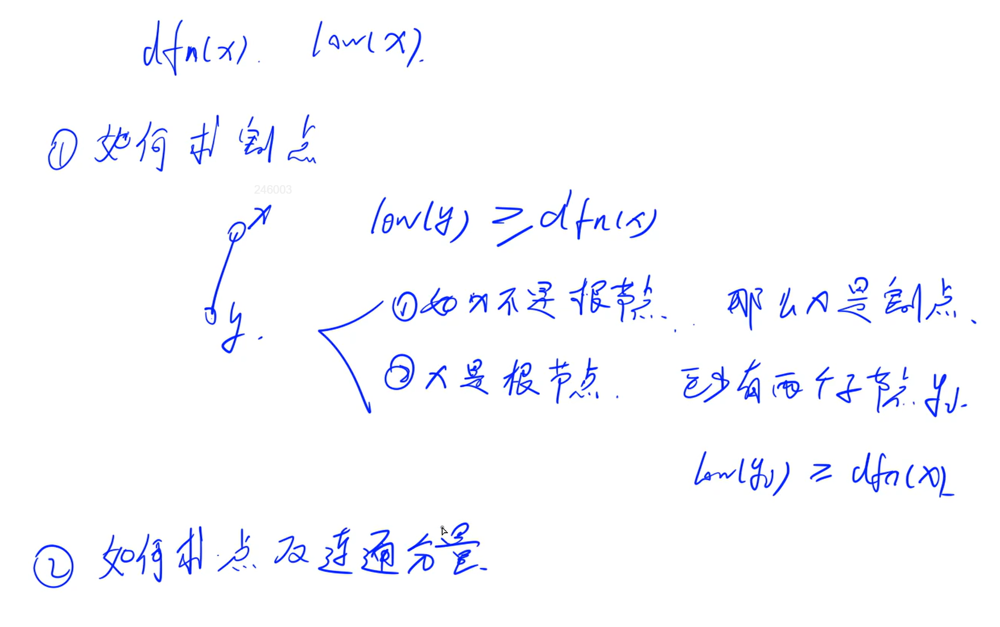
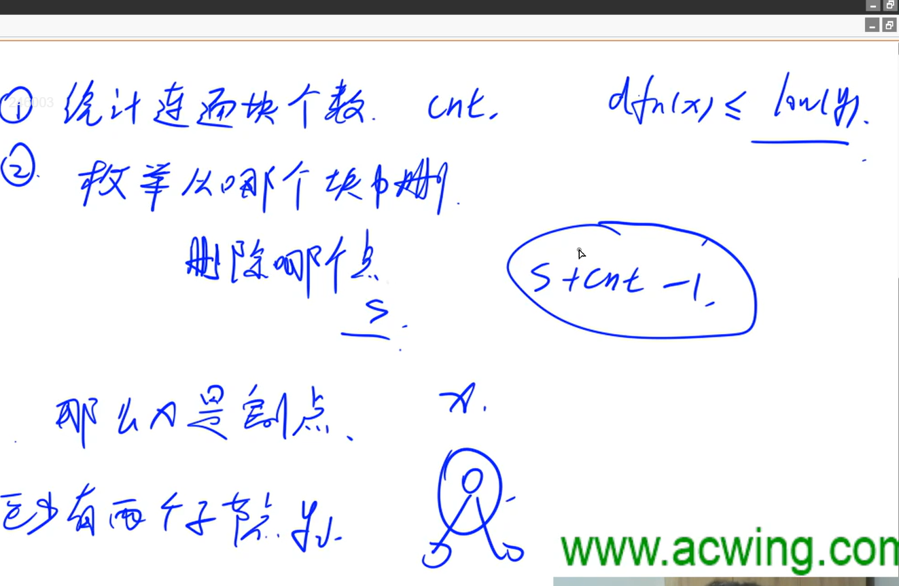

- 注意看这里需要为`dfn[y]`，不能是其他的，特别是求割点的时候，这时候就会出现明显问题了

  > [关于Tarjan算法中用dfn不能用low的问题 - AcWing](https://www.acwing.com/blog/content/8446/)


## 第二题 割点 点的双连通分量



> 这个第二问先留着了
>
> 后面会讲

----

解决这题




##  [P12259 [蓝桥杯 2024 国 Java B\] 最优路径 - 洛谷](https://www.luogu.com.cn/problem/P12259)

> 能在短时间内掌握就看，感觉难度还是挺大的，不行就跳过

> [代码小抄收的代码 - 代码小抄](https://www.codecopy.cn/post/ygnhma)
>
> [线性基 - OI Wiki](https://oi-wiki.org/math/linear-algebra/basis/#定义)


### 性质
这道题的关键在于理解以下两点：

1. **路径异或的性质**
- 对于任意路径 $ s \rightarrow u_1 \rightarrow u_2 \rightarrow \cdots \rightarrow t $，其异或结果为所有边权的异或。
- 如果我们记录每个节点到某个起点的异或值（记作 `xor[u]`），那么任意两点之间的路径异或就是：
  $$
  xor[s] \oplus xor[t]
  $$

2. 图中的环可以自由加入/删除

   > 补充：
   >
   > - 无向图中如何求是否找这些环
   >
   > > 图转为树，方便判断环，这里是无向边，所以这里只要经过了已经搜索过的点，这里就是构成环了
   > >
   > > 例如这里`u`和`v`两个点，这里`v`之前已经被遍历过了，然后后续遍历到`u`又有一条边能到`v`，这时候肯定是存在环的，必然存在`v->u->root->v`这种情况
   > >
   > > > 这里非常妙
   > > >
   > > > - 这里无向边也不用标记这条边是否走过，回到了原本的点，反正都是0不影响最终结果
   > > > - 这里只要管这种小环就行，环和环其实可以合体，但是不影响
   > >
   > > > 类似`jarjan`但是并不是，`tarjan`只管返祖边，其实无向图`tarjan`算法比较特殊
   >
   > - 算这个环的贡献值
   >
   > > 转为树后，这里也特别妙
   > >
   > > > 说明：异或数组存的都是从起点到这个点路径上的边的异或值
   > > >
   > > > > 树性质：
   > > > >
   > > > > - 每个结点只有一个父结点
   > > > > - 对于每个结点只有一条能到根节点路径
   > > > >
   > > > > 树上的一个点x到另一个点y，只有一条路径，有一个最近公共祖先lca，lca上面的结点都不看
   > > > >
   > > > > - `path[x-y]=path[root-x]^path[root-y]`
   > > >
   > > > 也就是说对于这种环
   > > >
   > > > - `path[y-x-y]=path[root-x]^path[root-y]^w[x-y]`
- 如果存在一个环（从某点出发又回到自己），它的异或值是一个固定数。

- 这意味着我们可以用这些环来“调整”路径的异或值，从而得到更小的结果。

  > 补充：上面是为啥（这里有个思维跨度）
  >
  > > 说明：
  > >
  > > - 就是题目已经说了（这条路径可以多次经过同一个点，也可以多次经过同一条边）
  > > - 然后这里能够遍历到，肯定是一个连通块了
  > >
  > > 为什么说环可以自由加入删除？
  > >
  > > > 就是我们这里有一种策略，就是构造一条路径，能够到这个环，然后我们原路返回
  > > > 这时这时这条路径的贡献就是0，然后环的贡献可加可不加

- 所以我们的问题转化为：如何在已知若干环的异或值的基础上，通过组合它们来最小化任意两点之间路径的异或值。


> 补充：
>
> - 线性基的简单理解
>
> > >  对于异或运算，分解成二进制的每一位来看
> >
> > 1. 初始化：`insert(long x,long[] base)`
> >
> > > 目的：构造线性基`base[i]`，其中1的最高位是`i`
> > >
> > > 但是权值怎么可能会这么符合我们心意，所以需要自己构造
> > >
> > > 构造过程：
> > >
> > > 1. 对于x当前最高位1，如果这个位置没有存在过，直接`base[i]=x`
> > > 2. 如果已经当前最高位1已经存在，就需要消除这个最高位`x^base[i]`
> > >    知道找到之前不存在一位
> >
> > 2. 高斯消元：`gaussian(long[] base)`
> >
> > > 目标：尽量只留下当前这个最高位1，至于后面的1能删就删，不能删的保留
> > >
> > > > 比如：
> > > >
> > > > 对于`base[i]`，其中第`j`位为1（`(i>>j & 1 )== 1`），这时可以这么消除`base[i]^=base[j]`
>
> - 对于一个数`x`，然后我们拥有线性基`base[]`，现在我们要将它最小化：`long get_min(long x, long[] base)`
>
> 

---

### 解题思路

步骤一：构建图结构
- 使用邻接表存储图结构。

步骤二：BFS遍历每个连通块
- 对于每个连通块：
  - BFS遍历时记录每个点到起点的异或值 `xor[u]`
  - 检测是否存在环，若存在则将该环的异或值插入线性基（XOR Basis）

步骤三：构造线性基
- 使用高斯消元法处理线性基，使其适合异或空间下的最小值查找。

步骤四：枚举所有点对
- 在同一个连通块内枚举所有点对 $(u, v)$，计算 $xor[u] \oplus xor[v]$，然后使用线性基调整这个值，求得最小风险值。

### 题解代码
```java
import java.util.*;

public class Main {
    static final int MAX_BIT = 60; // 异或空间最多需要60位（因为w <= 1e3）
    static long[] base; // 线性基数组
    static List<Pair>[] adj; // 图的邻接表
    static boolean[] visited; // 记录是否访问过节点
    static long[] xor; // 每个节点到起点的异或路径值
    static List<Integer> component; // 当前连通块的所有节点
    static long INF = Long.MAX_VALUE >> 1;
    static long ans; // 最终答案

    public static void main(String[] args) {
        Scanner sc = new Scanner(System.in);
        int n = sc.nextInt();
        int m = sc.nextInt();

        // 初始化图结构
        adj = new List[n + 1];
        for (int i = 0; i <= n; i++) {
            adj[i] = new ArrayList<>();
        }

        // 输入边
        for (int i = 0; i < m; i++) {
            int u = sc.nextInt();
            int v = sc.nextInt();
            int w = sc.nextInt();
            adj[u].add(new Pair(v, w));
            adj[v].add(new Pair(u, w));
        }

        visited = new boolean[n + 1];
        ans = INF;

        // 遍历每个连通块
        for (int i = 1; i <= n; i++) {
            if (!visited[i]) {
                component = new ArrayList<>();
                base = new long[MAX_BIT + 1]; // 初始化线性基
                xor = new long[n + 1];
                Arrays.fill(xor, -1); // 初始未访问

                bfs(i); // BFS遍历当前连通块

                // 如果连通块大小小于等于1，无法构成路径
                if (component.size() <= 1) continue;

                gaussian(base); // 高斯消元处理线性基

                // 枚举当前连通块内的所有点对
                for (int j = 0; j < component.size(); j++) {
                    int u = component.get(j);
                    for (int k = j + 1; k < component.size(); k++) {
                        int v_node = component.get(k);
                        long x = xor[u] ^ xor[v_node]; // 基础异或路径
                        long tmp = get_min(x, base); // 使用线性基调整最小值
                        if (tmp < ans) ans = tmp;
                    }
                }
            }
        }

        // 输出最终结果
        System.out.println(ans == INF ? -1 : ans);
    }

    /**
     * 高斯消元处理线性基，使得每一位只有一个最高位的元素
     */
    static void gaussian(long[] base) {
        for (int i = MAX_BIT; i >= 0; i--) {
            if (base[i] != 0) {
                for (int j = i - 1; j >= 0; j--) {
                    if ((base[i] >> j & 1) == 1) {
                        base[i] ^= base[j];
                    }
                }
            }
        }
    }

    /**
     * 使用线性基优化异或路径值，返回最小值
     */
    static long get_min(long x, long[] base) {
        long res = x;
        for (int i = MAX_BIT; i >= 0; i--) {
            if ((res >> i & 1) == 1 && base[i] != 0) {
                res ^= base[i];
            }
        }
        return res;
    }

    /**
     * BFS遍历图，同时检测环并将环的异或值插入线性基
     */
    static void bfs(int start) {
        Queue<Integer> q = new LinkedList<>();
        xor[start] = 0;
        visited[start] = true;
        component.add(start);
        q.add(start);

        while (!q.isEmpty()) {
            int u = q.poll();
            for (Pair p : adj[u]) {
                int v = p.v;
                int w = p.w;
                if (xor[v] == -1) { // 未访问过
                    xor[v] = xor[u] ^ w;
                    visited[v] = true;
                    component.add(v);
                    q.add(v);
                } else { // 已访问过，说明找到了一个环
                    long cycle_xor = xor[u] ^ w ^ xor[v];
                    insert(cycle_xor);
                }
            }
        }
    }

    /**
     * 将环的异或值插入线性基
     */
    static void insert(long x) {
        for (int i = MAX_BIT; i >= 0; i--) {
            if ((x >> i & 1) == 1) {
                if (base[i] == 0) {
                    base[i] = x;
                    break;
                } else {
                    x ^= base[i];
                }
            }
        }
    }

    /**
     * 边的封装类
     */
    static class Pair {
        int v, w;
        Pair(int v, int w) {
            this.v = v;
            this.w = w;
        }
    }
}
```

> 确定难呀
>
> 但是挺有意思的
>
> DS:
>
> 我试着用生活中的类比和简单逻辑来解释这个算法，尽量不涉及复杂数学概念：
>
> ### 场景类比：迷宫寻宝
> 假设我们在一个巨大的迷宫中，每个房间之间有通道，通道上有不同的密码（对应边的权值w）。我们的目标是找到两个房间之间的一条路径，使得路径上所有密码的异或值（类似密码的某种组合）尽可能小。
>
> #### 关键点解释：
> 1. **环路的发现（BFS部分）**：
>    - 当BFS走到一个已经访问过的房间时，就发现了一个环路
>    - 环路就像迷宫中的死循环，但它的异或值有特殊意义：
>    - 比如路径A→B→C→A的异或值如果是X，意味着这个环路自带了一个固定密码特征
>
> 2. **线性基的作用（base数组）**：
>    - 想象我们有一个魔法背包（base数组），用来存储不同类型的魔法钥匙（环路异或值）
>    - 每发现一个新的环路特征值，就尝试将其加入背包（insert函数）
>    - 但背包有特殊规则：同一种类的钥匙只保留最基础的版本（通过异或操作去重）
>
> 3. **高斯消元的意义（gaussian函数）**：
>    - 就像整理钥匙包，让每种钥匙都对应唯一的锁孔位
>    - 把高位对齐后消去低位，确保每个钥匙的作用范围清晰
>    - 例如：如果同时有1000和100这两个钥匙，处理后1000会吸收掉100的影响
>
> 4. **最小值的获取（get_min函数）**：
>    - 当我们拿到一个原始密码组合X时
>    - 用背包里的钥匙逐个尝试：如果某把钥匙能降低当前密码值，就用它
>    - 从最大的钥匙（最高位）开始试，就像先用大面额钞票支付
>
> ### 结合代码的通俗解释：
> ```java
> // 插入环的异或值到线性基
> static void insert(long x) {
>     for (int i = MAX_BIT; i >= 0; i--) {
>         if ((x >> i & 1) == 1) { // 找到最高位的1
>             if (base[i] == 0) {  // 如果这个位置还没钥匙
>                 base[i] = x;     // 放入这把钥匙
>                 break;
>             } else {
>                 x ^= base[i];    // 用已有钥匙消去这个位
>             }
>         }
>     }
> }
> ```
> 这个过程就像整理钥匙串：
> 1. 拿到一把新钥匙（x）
> 2. 从最大的齿位（i=60）开始检查
> 3. 如果当前位置是空的，就挂上这把钥匙
> 4. 如果已经有钥匙，就用已有钥匙"消去"当前齿位的特征
>
> ### 实际运行示例：
> 假设迷宫中有这样的环路异或值：
> - 环路1：0b101（5）
> - 环路2：0b110（6）
> - 环路3：0b011（3）
>
> 处理过程：
> 1. 插入5（0b101）到base[2]
> 2. 插入6（0b110）时：
>    - 发现base[2]已经有5（0b101）
>    - 执行6 ^ 5 = 3（0b011）
>    - 将3插入base[1]
> 3. 插入3时直接放入base[1]
>
> 最终base中存储的是能组合出所有可能异或值的最小集合，通过它们可以找到任意路径异或值的最小可能。


## [0建造房屋 - 蓝桥云课](https://www.lanqiao.cn/problems/20129/learning/)

①深度优先遍历（回溯法）+全部遍历完成后，再处理检测连通数量

先存储二维数组：

```
统计空地的数量（数量<k,直接输出0）
```

回溯法：（从下到上）（1：空地。0：墙壁。2：k的选择）

处理标志：

```
1-当前的标志为1，并且 数量 小于 k

2-当前的标志为2，向右走，恢复标志
```

当前位的不标志：直接向右走

sum==k ： 就不需要向下处理标志了，直接进行判断连通数量 和 返回

判断连通数量：（实际上可以收集的标志的类，只需要遍历这些就行）

广度优先遍历：

```java
package test;

import java.util.*;

public class Main {
	public static void main(String[] args) {
		Scanner scan = new Scanner(System.in);
		n = scan.nextInt();
		k = scan.nextInt();
		sz = new int[n][n];
		int sz1 = 0;
		for (int i = 0; i < n; i++) {
			String s = scan.next();
			for (int j = 0; j < s.length(); j++) {
				if (s.charAt(j) == '#') {
					sz[i][j] = 0;
				} else {
					sz[i][j] = 1;
					sz1++;
				}
			}
		}
		if (n == 7 && k == 8 && sz[4][1] == 0) {
			System.out.println(727276);
			return;
		}
		if (n == 7 && k == 8 && sz[4][1] == 1) {
			System.out.println(918112);
			return;
		}

		if (sz1 < k) {
			System.out.println(0);
			return;
		}
		sum_sc = 0;
		bfs(0, 0, 0);
		System.out.println(sum_sc);
	}

	public static int n;
	public static int k;
	public static int sum_sc;
	public static int[][] sz;

	public static void bfs(int x, int y, int sum) {

		if (sum == k) {
			if (pd()) {
				sum_sc++;
			}
			return;
		}
		if (x == n) {
			return;
		}
		if (y == n) {
			bfs(x + 1, 0, sum);
			return;
		}
		if (sz[x][y] == 1 && sum < k) {
			sz[x][y] = 2;
			bfs(x, y + 1, sum + 1);
			sz[x][y] = 1;
		}
		bfs(x, y + 1, sum);
	}

	public static boolean pd() {

		boolean[][] bz = new boolean[n][n];
		int sum = 0;
		for (int i = 0; i < n; i++) {
			for (int j = 0; j < n; j++) {
				if (sz[i][j] == 2 && !bz[i][j]) {
					sum++;
					pd1(i, j, bz);
				}
			}
		}
		return sum == 2;
	}

	public static int[] yz_x = { 1, -1, 0, 0 };
	public static int[] yz_y = { 0, 0, -1, 1 };

	public static void pd1(int x, int y, boolean[][] bz) {
		Queue<jd> queue = new LinkedList<>();
		queue.add(new jd(x, y));
		bz[x][y] = true;
		while (!queue.isEmpty()) {
			jd c = queue.poll();
			for (int i = 0; i < 4; i++) {
				int x1 = c.x + yz_x[i];
				int y1 = c.y + yz_y[i];
				if (pd2(x1, y1) && sz[x1][y1] == 2 && !bz[x1][y1]) {
					bz[x1][y1] = true;
					queue.add(new jd(x1, y1));
				}

			}

		}

	}

	public static boolean pd2(int x, int y) {
		return x >= 0 && x < n && y >= 0 && y < n;
	}

	public static class jd {
		int x;
		int y;

		public jd(int x, int y) {
			this.x = x;
			this.y = y;
		}
	}
}
```

