[天梯赛 一至十三届题解合集（最简洁规范题解）_天梯赛题目集-CSDN博客](https://blog.csdn.net/qq_60755115/article/details/130341113)

[GPLT团体天梯赛 — 比赛技巧及知识点-CSDN博客](https://blog.csdn.net/qq_40946921/article/details/88636096)


# 蓝桥杯

> 特别小心，一点点小失误就没分了

- **不要草率多造点样例，尽量去涵盖所有输出**

  > 至少造五个:
  >
  > 很特殊的：相同的，不行的，翻转一下的，特别一般的（不是树，或者多边）
  >
  > 写样例答案的时候一定要对照着题目来
  >
  > - **最好不要忘记照照稍微大点的样例，算不出来也没事，看看程序会不会出错**
  > - ==最好就是模拟好样例再开始写==

- 在复习下概念

- 感觉正解很麻烦，先把能拿的都拿了

- ==***题目多读，一定要读清楚***==,==**细心点**==，**==样例模拟清楚，在开始写代码==**

  > 好几次这样了
  >
  > ==**一定一定一定要看清楚：**==
  >
  > 
  >
  > - ***输入输出格式***
  >
  >   > 对照着敲，不要大概看
  >
  > - ***样例***
  >
  > - ***数据范围***
  >
  > - 看边是双向还是单向
  >
  > > **一个个字的读，标好所有关键**

- 如果感觉自己的思路有点问题，或者过于麻烦，同时还有一些题没有做完，建议先跳过

  > **感觉这道题很麻烦，可以果断点直接跳过，不要浪费太多时间，鉴别下难度，过难就跳过**
  >
  > **不要死磕**，==超过10分钟没有思路，先把暴力敲上==
  >
  > 实在不行，就直接把暴力打赏

- 一定要分类讨论清楚

- **算好时间复杂度，通过这个来选算法**

  > 如果没想出正解，直接用莽就行，有时候样例差还是能过的

- **==后续写的时候最好要思路全部整好在下笔==**


- 蓝桥杯，感觉部分难度不对劲（难、代码量大、长代码模板的）的时候的，感觉跑，等没得开题的时候在回来看看


- **感觉最好就是想好再作答，同时先多造造样例再开始写代码，到了国赛保证准确率感觉反倒会更重要点**


- **复杂度允许，最好就是用最粗暴的方法**

  > 时间复杂度一定要算好，`1e8`左右直接莽就好
  >
  > > 例如：最粗暴的办法，如果复杂度允许，剪枝又难写就不要剪枝了
  > >
  > > [16届蓝桥杯14天省赛冲刺营 1期 - 【真题】九宫幻方 - 蓝桥云课](https://www.lanqiao.cn/courses/46292/learning/?id=3441385&compatibility=false)
  > >
  > > 当时就是一直想着剪枝，剪了半天的写出来，还不如直接粗暴的莽过去

- 如果感觉实在过于麻烦，但是题目分值又不高，这时候就尝试下贪心或者非常暴力的方法

- **如果实在做不出来，不要忘了最暴力最直接的方法**，详细挑出一个数看看有没有什么规律；看看能不能优化；再不行就先敲上

  > 如果感觉过于麻烦也先敲这个

- **最好把每道题都看看，先从代码简单的开始，不一定是按照难度梯度**

- 概念也要复习，唉，反正好几次蓝桥杯的题目都是不会解释的

- **超过15分钟没想出来的，如果感觉暴力比较好敲的话，先把暴力敲上，不要再想了**


**开始准备**：

- eclipse准备好提示词，包，模板，复制下各个项目
- excel、c++最好都准备下


java:

```java
//package test;
import java.io.*;
import java.util.*;
public class Main{
	static final int N=(int)310;
	public static void main(String[] args) throws Exception {
		Scanner sc=new Scanner(System.in);
//		Scanner sc = new Scanner(new File("src/test/i.txt"));//相对路径，从src开始:src/包名/输入文件
//		Scanner sc=new Scanner(new File("D:\\EclipseCode\\AlgorithmPractices\\src\\test\\i.txt"));//绝对路径（从终端中复制），忘记了就用这个
		BufferedReader br=new BufferedReader(new InputStreamReader(System.in));
		BufferedWriter bw=new BufferedWriter(new OutputStreamWriter(System.out));
		String[] ss;
		
		
		bw.flush();
	}
}
```

> 本处文件输入就是防止一下控制台输入过大，很容易吞掉东西

----

检查点：

- long
- 无向边:需要注意下两个方向（邻接表：边数\*2、加两个方向、邻接表除`h[x]`）
- 各种集合数据结构需要判空
- ==包名==


----

骗分：

- 分支法：担心拿不到全部的分，但是有部分可以暴力

  > ```
  > if(n<能够暴力的范围){
  > 	//这部分暴力
  > }else{
  > 	//这部分正常做
  > }
  > ```


---

实用技巧：

- 打表：就是感觉答案不多，但是复杂度会稍微超的时候，可以尝试下把所有的可能都打出来。

- `java`的`PII`平替：`new int[2]`


# ==TODO==:不会便忘记骗分

- 走不了情况


```
extension://ngbkcglbmlglgldjfcnhaijeecaccgfi/https://cdn.fzoi.top/upload/user/jz20240202/22092412459151.pdf


https://www.acwing.com/file_system/file/content/whole/index/content/7989399/

```


# ==TODO==：DEGUG


## 备赛安排

关键时间点：

- 蓝桥杯省赛：4月12日 9:00-13:00
- 天梯赛：4月20日
- 蓝桥杯国赛：6月初


----

### 需要完成任务

大方向：

- ACWING:两个每日一题、蓝桥杯辅导课AB组

- 蓝桥云课：省赛冲刺课

  > 从三月中旬开始

- 历次国赛和省赛真题（做四五年左右）

  > - 每周至少花四个小时做一份，最好就是A掉所有题，同时整理复盘
  > - 整理历年真题的中出现的算法

- 省赛到天梯赛的间隙做天梯赛真题

----

 小目标：

> - ==按官方给的知识图谱学，现在先把**最基础**都过完就行==
>
> - [==好好看看这个经验分享==](https://blog.csdn.net/china_daniel_liu/article/details/125960060)
>
> - 数论复习
>
>   > 尤其判断质数、筛质数、什么唯一分解定理、快速幂、组合数
>   >
>   > 多敲
>
> - 数据结构进阶：并查集（进阶）、树状数组、线段树、树上差分、DFS序、在看眼单调栈单调队列
>
>   > 有时间再说：分块和莫队
>
> - 图论复习（先初步复习）
>
>   > 虚拟源点技巧
>   >
>   > 后续**最短路+生成树**，一定要多敲
>
> - 贪心复习：尤其是绝对值不等式的那些
>
> - **概率和期望**
>
> - **同余**
>
> ---
>
> 优先级一般：
>
> - 矩阵乘法
>
> ----
>
> 
>
> 优先级较低：
>
> - 计算几何基础


----


## 真题

> 写点复盘和算法


> 题目的顺序是按蓝桥杯官网的真题的顺序
>
> 有的就不写题目了，有点麻烦


> - 其实几乎都是热门考点的算法
> - 但是不能只会模板，要会变形

### J B 15届省赛

> 当时打比赛和现在模拟都是50分左右
>
> [2024 第十五届蓝桥杯JavaB组省赛思路分享_蓝桥杯 食堂-CSDN博客](https://blog.csdn.net/qwioiwp/article/details/137722991?spm=1001.2014.3001.5501):当时比赛的情况

A. 暴力枚举+找规律

> 每一120一个规律
>
> 拿下

B. 暴力枚举

> 拿下

C. 模拟

> 直接暴力模拟就行
>
> 加点**思维**，会简单特别多，都不用用到数据结构
>
> 拿下

D. 贪心

> > 如果在遇到我估计也够呛
>
> 唉，当时和现在模拟时都没做出来，当时比赛用的是DP，现在用的是贪心，但是没注意到可以不选完
>
> **如果自己的做法感觉太过麻烦，最好直接跳过**
>
> 这个属于比较前面的，按道理说都不会太难，如果是比赛的时候最好就是用贪心莽莽

E. 期望+暴力

> 半拿下
>
> 但是这题其实是有点问题，就是蓝桥杯官网的数据有点弱，ac了，但是在acwing对了大部分，还有部分错了
>
> 这里我这个代码其实是有小错误的
>
> 就是一定要 **分类讨论** 清楚，列好每种情况，每种情况的消耗

F. 期望+Floyd 或者 期望+bfs最短路

> 半拿下（蓝桥杯能过，但是这里acwing过不了）
>
> 每个点到任意一点，floyd解决的就是这个问题，但是会发现数据量太大了，过不了
>
> > Floyd直接暴力，三行for循环就行，可以写得很快，会比bfs写的快很多，但是会超时一小部分样例，如果没事时间了直接考虑这个
>
> **这里边权为1**，可以考虑bfs就行了，接下来就是想优化，直接每个点跑bfs，发现能过
>
> > 有时间将bfs完整的敲出来

G. 暴力枚举DFS+形状判断

> 代码很难写，赛时没有写出来，这种没有预留超过50分钟就别开
>
> 赛后写出来，但是只过了官网的样例，acwing的没有全过
>
> 甚至都不用剪枝优化

H. 排序+区间查询单点修改+双指针

> /啊，没做出来，只写了暴力，唉，会这些算法，也想过区间查询，但是就是没想到可以先排序，顺序并不重要，难受


### J B 11届省赛

> 说实话，做的时候感觉题型不太一样呀
>
> 跟最新的那届还是差挺多的
>
> 但是就是题目的考点和难度差不多


> 过了的不多说且没问题的不多说，主要写写没过的和策略


1. 暴力枚举+数位分解

2. 暴力

   > - 看看eclipse输入大数据怎么办
   >
   >   > 文件输入

3. 找规律

   > 蓝桥杯很多填空题都是有规律的
   >
   > 本题能写代码，但是感觉如果要写代码可能需要20分钟以上，耗不起

4. 七数码：转化为图+枚举（dfs|二进制枚举）

   > 敲，耗了快一个小时，还没对
   >
   > > 服啦，后面的补的时候还是敲了好久还是不对，这种题还是跳过吧，不要浪费太多时间
   >
   > 哎呀，说不定在纸上手写，都比这个快
   >
   > - **以后感觉自己思路很麻烦的，分值还不高，可以先跳过了**
   >
   > - 感觉情况不过100，也能自己手写下
   >
   > - **不计较复杂度的话，越粗暴简单越好**
   >
   >   > - **建议用邻接矩阵**，比邻接表错的概率低
   >   > - 二进制枚举更简单点
   >   > - **不要去想优化，最用最暴力的**
   >
   > 
   >
   > 难点：
   >
   > - 是否相连：可以转为边，变为图
   >
   > - 如何不重不漏的枚举：
   >
   >   - 如果看当前状态是否出现过？**二进制**
   >
   >     > 也能对每个字母排序，但是过于麻烦了
   >
   >   - 如何枚举？二进制枚举或者dfs都行
   >
   > - 怎么看当前集合的点是否都是相连的：并查集
   >
   > 

5. 选择排序

   > 代码填空题，感觉有点鸡肋呀，挺废的一种题型
   >
   > 注意了最后交的是完整代码
   >
   > > （没注意看这个，只提交了填空的代码）

6. 签到题：（最大、最小和平均数）

7. 签到题：统计字母的个数

8. 思维（找规律）+ DP(数字三角形)

   > 主要就是规律还是不好一眼秒的，代码难写点

9. 子串分值和：贡献法

   > 本题其实不难，但是由于时间不够，去做最后一题了，只写了个暴力

10. 装饰珠：思维+贪心+分组背包

    > 相当恶心，题目又臭又长，不太好懂，代码也难，没有50分钟以上，就不要开
    >
    > 这里我的思路大方向没错，有一些细节没对，很难写，有很多思维点需要去转换，算比较难的题了
    >
    > 看了很久题解，也不知道自己写的哪里错了，题解多了个维度，而且有几步，真的不知道是为什么，
    >
    > - 这里后续发现思路大体上没问题，但是有一个点没解决就会，等级放的顺序，这个很重要，这里其实感觉都是将`j`维度分段了，如果不注意放的顺序，后出现真空的情况


### J B 11届国赛

> 哇靠，第一次做国赛的模拟题，跟省赛难度相比难度直线上升
>
> 省赛可以无脑做，但是国赛基本都是要动脑子的，同时基本都涉及到算法，而且代码还不好写，一个是码量大，一个是细节问题太多
>
> 填空题的基本都不难，但是编程从第一题开始就上难度了
>
> 这里我是将填空全做出来了，编程只对了第一题，其他的骗分都不好骗


> 这个卷子（按蓝桥云课官网的分）估计能拿到：40-70左右的分，唉，离目标还是有点远
>
> 感觉后续需要现场至少做出第一道及以上的中等题和难题，唉

1. [美丽的 2](https://www.lanqiao.cn/problems/1018/learning/)：暴力枚举+数位分解

   > 没难度，细心就行

2. [扩散](https://www.lanqiao.cn/problems/1019/learning/)：暴力枚举

   > 需要动点脑子，
   >
   > 最好就是从格子本身出发，最好就是别用搜索，这个不太直接，容易错

3. [阶乘约数](https://www.lanqiao.cn/problems/1020/learning/)：约数个数

   > 需要动下脑子，也不是很直接的模板题

4. [ 玩具蛇](https://www.lanqiao.cn/problems/1022/learning/)：暴力枚举（dfs）

   > 暴力枚举就完事了

5. [ 蓝肽子序列](https://www.lanqiao.cn/problems/1030/learning/)：最长公共子序列

   > 变形下就是模板题
   >
   > 但是这才第一题呀，呜呜，以前的送分题呢

----

> 从这开始基本都是没做出来

6. [ 皮亚诺曲线距离](https://www.lanqiao.cn/problems/1023/learning/)：模拟+递归

   > > 感觉题目其实是有问题，如果严格按照题目的数据范围，感觉一定是爆的，必须使用高精度，但是实际的样例并没有
   > >
   > > **所以像蓝桥杯和天梯赛这种，感觉复杂度可能可以时候，最好就是莽莽看**
   >
   > 这题废了快一个小时，当时没注意看题和样例，理解错了，再加上代码写成依托了，救不回来了
   >
   > 后续的补的时候又倒在一些细节上了，唉
   >
   > 但是本题还是挺有启发的，感觉我后续补题虽然还是错了么，但是感觉代码设计的还是挺好的
   >
   > 后续经过测试，如果不用高精度（9/10，会有一个样例点过不掉），不过也没事

7. [ 画廊](https://www.lanqiao.cn/problems/1032/learning/)：贪心+DP

   > > 可恶呀，就不能解释下样例或者简简单单画个图，看了半天，才明白
   >
   > 本题其实是能过的，但是我贪心结论是猜的，不太确定，所以没开
   >
   > > 感觉就是应该开下去的，只看三个点的情况，根据两边之和一定大于另一条边就能证明出来
   > >
   > > 唉，**后续一定不要死磕，一定要把能写的都写上**
   >
   > 如果这题开下去，就有70分的水平，但是这里选择开了6和8的结果都寄

8. [补给](https://www.lanqiao.cn/problems/1050/learning/)：贪心+floyd求最短路+状压dp

   > 基本算是那种很难做出来的题了
   >
   > 本题就不好写，它还在数据范围那里阴一手，**像状压dp这种，最好不要多开**

9. [质数行者](https://www.lanqiao.cn/problems/1027/learning/):DP+方向分解

   > **不会别忘了，骗分，==特别是走不了的情况==**
   >
   > - 本题后续看是跟题解思路一样，也挺好想的，但是当时一点没看，可惜，虽然也不一定能写对
   >
   > > 这个我就不写代码


### J B 12届省赛


> 感觉做的不太好，3没做出来，89写了暴力，拿了一班以上的分，花一个小时开10但是失败了，其他都拿下了
>
> 93/150
>
> - 但是分数其实也不算很低， **就是千万不要死磕，性价比不高就跳，感觉做出来先敲上暴力，赶紧下一题**

> 填空题有点小多
>
> **多从数据范围出发**
>
> 后续看了下编程题难度还是挺高的
>
> 这份卷子感觉还是挺陌生的
>
> 追求满分还是挺难的，这场太过思维了

1. [ASC](https://www.lanqiao.cn/problems/1446/learning/)：语法基础题，送分的，ASCII码

2. [卡片](https://www.lanqiao.cn/problems/2383/learning/)：思维题

   > 从n种卡片最多表示几张就很简单

3. [ 直线](https://www.lanqiao.cn/problems/1449/learning/)：枚举+计算几何基础

   > 呜呜，奇了怪了，当时就是没想出来，想到什么浮点误差什么最大公因数什么的，直接寄了
   >
   > - 计算几何基础：`y=kx+b`
   > - 或者可以直接把两个点都存下来那种
   >
   > > 经验太少了对这种计算几何的题

4. [ 货物摆放](https://www.lanqiao.cn/problems/1463/learning/)：约数个数+枚举

   > 直接暴力做，算几天都出不来
   >
   > 本题需要动点脑子，不能直接枚举，不然也是不好做的
   >
   > > **用粗暴直接的方法，但是别忘记要多动点脑子**
   >
   > 简单模拟下，就会发现只跟各个质因子有关（跟具体的质因子也没有关系）
   >
   > 暴力点：长宽高，一共有三个位置①②③，一个个位置枚举就好
   >
   > 但是会发现这样其实代码不算特别好写，还能再优化下代码：只枚举①的位置上的质因子个数，②的其实就是就是剩下的约数个数，③是固定的
   >
   > 优化：只需要枚举①这个位置即可
   >
   > ---
   >
   > 上面是我模拟赛时候的做法：还有更直接的，就是直接枚举所有约数，最后乘积等于这个数就行

5. [路径](https://www.lanqiao.cn/problems/1460/learning/)：法1（最直接的）：最小公倍数（包含`gcd`）+`dijkstra`  | 法二（代码简单）：最小公倍数+`dp`

   > 按着题目意思模拟就完事了，就是代码稍微麻烦了点，其他也没啥了
   >
   > 比赛的时候直接就是用暴力了
   >
   > ---
   >
   > 其实感觉用动态规划会快点，代码简单点，可惜当时没想到，不过是填空题，又担心错，唉

6. [ 时间显示](https://www.lanqiao.cn/problems/1452/learning/)：单位转换

   > 挺简单的，但是当时犯傻了，还想着日期模拟的，耽误了十分钟

7. [最少砝码](https://www.lanqiao.cn/problems/1461/learning/)：思维+规律+贪心

   > 跟填空题2一样，思路找到了就简单
   >
   > 也是逆着想，从`n`个砝码最多表示几个，这样出发会简单很多

8. [ 杨辉三角形](https://www.lanqiao.cn/problems/1457/learning/)：思维+规律+组合数+二分

   > 敲上暴力就跑了
   >
   > 还好没开，感觉如果要切题时，感觉也没有思路，做不出来
   >
   > ---
   >
   > 此题还是挺有启发的，我总忘记要能够暴力，特别是二分这种

9. [双向排序](https://www.lanqiao.cn/problems/1458/learning/):思维+规律+栈

   > 敲上暴力就跑了， **需要注意`Arrays.sort(T[],起,中,排序函数)`只能是引用类型**
   >
   > ```java
   > //从小到大
   > Arrays.sort(a,mid,n+1);
   > //从大到小
   > Arrays.sort(a, 1, mid+1,(x,y)->{
   > return y-x;
   > });
   > ```
   >
   > 暴力能过一半及以上
   >
   > ----
   >
   > 挺难的，必须去挖掘各种性质，还是挺思维的；如果想不出来就需要上各种树的数据结构了。
   >
   > > y总都说有点过于难了放在b组
   >
   > - **这种思路：需要多画图模拟出来**
   >
   > 细节太多了，即使自己敲也不好对
   >
   > - 本题可以看看`[l,r]`不断缩小的边界问题
   >
   > > 题解在acwing中

10. [括号序列](https://www.lanqiao.cn/problems/1456/learning/):dp+利用独立对称性质

   > 没想出来，浪费了一个小时，思路方向对，但是没想好，进入死循环了
   >
   > ---
   >
   > 
   >
   > 不过这题还是不错的，挺有启发的
   >
   > 但是难度还是挺大的，独立想出来的概率不大


### J B 16届省赛（1）

> 因为大风延期了，所以要打第二场，这里在第二场开始前做了下
>
> 这份难度挺简单的，有时候感觉前面比后面的难
>
> 代码放在eclipse了

> 在洛谷测了下，拿了90，因为粗心失掉了10分，还有一个并查集的不知道为啥会超时超内存

A：暴力模拟

B：暴力枚举

> 但是这题需要动点脑子，从整除出法，只枚举倍数
>
> 纯暴力是不行的

C：异或和的思维

> 猜出结论，但是不会原理

D：线性筛+计数查找

> 半对
>
> 又粗心了，数据范围没有写对， **后续可以考虑动态数据范围了**
>
> 计数查找`boolean st[所有数出现的范围]`

E：最小生成树（prim）

> 半对，用加边法超时了
>
> 稠密图，只能用这个，用`kruskal`会超时
>
> **不建议这种有序样例的形式**
>
> ```
> 4
> 0 0 1
> 0 3 1
> 0 6 1
> 0 9 1
> ```
>
> 建议：
>
> ```
> 4
> 0 0 1
> 0 9 1
> 0 3 1
> 0 6 1
> ```
>
> 还有就是加边建议造一个从终点逆着看的样例
>
> **易错：**
>
> - 根据复杂度选算法，如果`kruskal`达到`1e8`的复杂度了，就要用这个了
>
> - 没有标记已经走过
> - 没有判断但前的**最短路是否不存在**，不能判断`t=-1`
> - **`dist[j]=min(dist[j],link[t][j]);`**
>   - 注意是t，不是i、
>   - 加入以`t`相连的边，不是路径不要加上之前的，如`dist[t]+link[t][j]`

F：双指针+贪心

> 对
>
> 比较简单，不多说

G：DP

> 对
>
> 最难的一道
>
> 这个dp还是不太好想的，主要就是会有一堆细节问题

H：贪心+排序

> 我这里有点问题，虽然能够骗到大部分样例，只有一个过不了
>
> 我的贪心策略(错误)：B中n的用1抵掉，剩下的都能获取
>
> > 错误样例：
> >
> > ```
> > 输入：
> > 4
> > 3 2 1 4
> > 输出：
> > 4
> > ```
>
> 实际贪心策略：B中大的可能被相等的抵掉，剩下的获取


> **边界样例不要能测的话别忘了**
>
> 这里会有一个样例没过掉
>
> **==能够复杂度允许，建议暴力枚举版的贪心，不然可能会有疏漏==**


### J B 15届国赛

> 当时打崩了，就当时就拿了二三十分，但是其实是不应该的，应该要能拿到60分以上的
>
> 这套题特别考验策略和冷静，策略错了基本就没了
>
> 
>
> 总结
>
> - **==认真读题，认真模拟==**
>
>   > 当时第一道和第三道编程一个倒在边界问题上（没有好好模拟），一个倒在读题上
>   >
>   > 第二道后面再做又脑抽了，这种没办法，但是一定要把暴力搞上
>
> - **==注重做题策略，在规定时间内拿到最高的分==**
>
>   > 该放的题一定要先放
>   >
>   > 后面的题不一定比前面的题难，所以一定要大胆放，注重策略

> 第二次做：拿了83分，但是把四个小时分成两次做了，可能不太准，这次做的时候状态会比较好

1. [0七边形 - 蓝桥云课](https://www.lanqiao.cn/problems/20110/learning/)：思维+模拟

   > 一定要带脑子做填空，不然也要做很久

2. [0宝塔 - 蓝桥云课](https://www.lanqiao.cn/problems/20111/learning/)：dfs

   > 当时预计要半个小时左右能做出来，策略，这里放掉了没做
   > 后面补题时差不多就需要这么久，没办法
   >
   > **但是这里我其实感觉手工填更快**，但是当时以为是求方案数的，结果只有一种
   >
   > 这里我题目没读清楚，也浪费了一些时间，**一定要注意读题**

   > 这里也不是简单的dfs，必须是要优化的，这里我是先预处理出行的可能，然后一行行枚举，最后判断列就行
   > 这里代码没有点技巧其实也不好写

3. [0美丽区间 - 蓝桥云课](https://www.lanqiao.cn/problems/20134/learning/)：构造(贪心+双指针)+二分

   > 第一题就上这种难度
   >
   > 哇靠考试的时候，因为二分的边界问题卡了可能要一两个小时，真不值呀，当时二分的题刷得不多，唉
   > **以后要是有个小点卡15分钟，直接跳过**

   > 反正就是让每个区间差都最小就行，一般前面的题看数据范围，一般很大的时候都是贪心，第一题要是上dp太恶心
   >
   > （再不济奇数和偶数的gcd为1，也就是说其实差得不远，距离在一小段内必然存在，一会出现很不规则的情况（这种就贪心不了））
   >
   > 然后这里只要记录左右的其中的一个就行，这里只记录左界，然后进行二分，找到小于等于的最大值就行

4. [0园丁 - 蓝桥云课](https://www.lanqiao.cn/problems/20163/learning/)：贪心+思维+质因数分解+图遍历

   > 这题当时考试的时候和后续练习都没搞出来，但是暴力过了，所以还是要试着敲一下暴力的，结果是能过的
   > 一定不要不要放弃任何的机会——在终场哨响之前，没有什么是不可能的

   > 这题基本大部分东西都想出来了，但是有个小点一直卡着，就是要怎么找完全平方数那边卡着了
   >
   > - 自己的暴力：这里我没想出来正解的解法，这里我是用用两重循环直接暴力找`A[i]*A[j](i<j)`能够与后面的数构成平方的就把`A[i]`删除
   >
   > ------
   >
   > - 核心：集合中找两个数的乘积为完全平方数的组合
   >
   >   > 这里放在基础课的题解里面了，这里就不细讲了
   >
   >   - 方法：**要能构成完全平方数，必然质因数分解的质因数为奇数次幂的集合要是相等的**
   >     **表示质因数为奇数次幂的集合，直接用一个乘积表示即可（唯一分解定理）**
   >     这里用一个字典结构存下相同的乘积有多少个即可

5. [4.数据库 - 蓝桥云课](https://www.lanqiao.cn/problems/20144/learning/)：映射+排列组合

   > 敲，当时比赛的时候没有仔细看题目，这题直接白给了
   >
   > 现在再做感觉其实不难
   >
   > **==一定一定要仔细读题，不要放过题目的每一句话，模拟样例==**
   >
   > > - 主要题目说不会重复出现，而且合法；才能这样
   > >
   > > - 用字典记录下同id的操作就行，然后就是不断放剩下的位置

6. [0分组 - 蓝桥云课](https://www.lanqiao.cn/problems/20119/learning/)：思维+双指针+贪心

   > 这题比前面很多题都简单
   >
   > **所以难度不一定是按顺序的，后面的题也要看看，如果感觉前面的题不好做或者需要特别多时间久先跳过，看看后面的题**

   > 当时模拟四五个样例找到的，同时还证不了伪的
   >
   > 如果能证伪但是找不到正解，也可以把贪心敲上去

   > 证明放在当时写的代码里了

7. [0背包问题 - 蓝桥云课](https://www.lanqiao.cn/problems/20172/learning/)：多路归并

   > 如果写过多路归并这题难度就不算大，推一下就能搞出来，没写过就麻烦了

   > 多路归并：利用优先队列，用前面的结点不断去推后面排名的结点
   >
   > > 基本只要不重不漏，不爆空间就没啥问题
   >
   > 场景：
   >
   > - 多个序列，合并成一个序列
   > - 一个特别的大的序列（全部放下肯定爆），找其中的第k个
   >   像这种大序列一般都能够进行推导的，可以由前面的数，推导在它后面的数（具有单调性）

8. [0最优路径 - 蓝桥云课](https://www.lanqiao.cn/problems/20168/learning/)：图遍历+路径异或性质+高斯消元处理线性基

   > 难度：省选题
   >
   > 不太可能做出来，估计只能敲个最最暴力的情况（基本带不了啥优化），暴力应该能搞到60%
   >
   > 这题正解真的超级妙，但是根本不太可能做出来

   > 巧妙的点：
   >
   > > 这道题的关键在于理解以下两点：
   > >
   > > 1. **路径异或的性质**
   > >
   > > - 对于任意路径 $ s \rightarrow u_1 \rightarrow u_2 \rightarrow \cdots \rightarrow t $，其异或结果为所有边权的异或。
   > >
   > > - 如果我们记录每个节点到某个起点的异或值（记作 `xor[u]`），那么任意两点之间的路径异或就是：
   > >   $$
   > >   xor[s] \oplus xor[t]
   > >   $$
   > >
   > > 2. 图中的环可以自由加入/删除
   > >
   > >    > 补充：
   > >    >
   > >    > - 无向图中如何求是否找这些环
   > >    >
   > >    > > 图转为树，方便判断环，这里是无向边，所以这里只要经过了已经搜索过的点，这里就是构成环了
   > >    > >
   > >    > > 例如这里`u`和`v`两个点，这里`v`之前已经被遍历过了，然后后续遍历到`u`又有一条边能到`v`，这时候肯定是存在环的，必然存在`v->u->root->v`这种情况
   > >    > >
   > >    > > > 这里非常妙
   > >    > > >
   > >    > > > - 这里无向边也不用标记这条边是否走过，回到了原本的点，反正都是0不影响最终结果
   > >    > > > - 这里只要管这种小环就行，环和环其实可以合体，但是不影响
   > >    > >
   > >    > > > 类似`jarjan`但是并不是，`tarjan`只管返祖边，其实无向图`tarjan`算法比较特殊
   > >    >
   > >    > - 算这个环的贡献值
   > >    >
   > >    > > 转为树后，这里也特别妙
   > >    > >
   > >    > > > 说明：异或数组存的都是从起点到这个点路径上的边的异或值
   > >    > > >
   > >    > > > > 树性质：
   > >    > > > >
   > >    > > > > - 每个结点只有一个父结点
   > >    > > > > - 对于每个结点只有一条能到根节点路径
   > >    > > > >
   > >    > > > > 树上的一个点x到另一个点y，只有一条路径，有一个最近公共祖先lca，lca上面的结点都不看
   > >    > > > >
   > >    > > > > - `path[x-y]=path[root-x]^path[root-y]`
   > >    > > >
   > >    > > > 也就是说对于这种环
   > >    > > >
   > >    > > > - `path[y-x-y]=path[root-x]^path[root-y]^w[x-y]`
   > >
   > > - 如果存在一个环（从某点出发又回到自己），它的异或值是一个固定数。
   > >
   > > - 这意味着我们可以用这些环来“调整”路径的异或值，从而得到更小的结果。
   > >
   > >   > 补充：上面是为啥（这里有个思维跨度）
   > >   >
   > >   > > 说明：
   > >   > >
   > >   > > - 就是题目已经说了（这条路径可以多次经过同一个点，也可以多次经过同一条边）
   > >   > > - 然后这里能够遍历到，肯定是一个连通块了
   > >   > >
   > >   > > 为什么说环可以自由加入删除？
   > >   > >
   > >   > > > 就是我们这里有一种策略，就是构造一条路径，能够到这个环，然后我们原路返回
   > >   > > > 这时这时这条路径的贡献就是0，然后环的贡献可加可不加
   > >
   > > - 所以我们的问题转化为：如何在已知若干环的异或值的基础上，通过组合它们来最小化任意两点之间路径的异或值。
   > >
   > > 
   > >
   > > > 补充：
   > > >
   > > > - 线性基的简单理解
   > > >
   > > > > >  对于异或运算，分解成二进制的每一位来看
   > > > >
   > > > > 1. 初始化：`insert(long x,long[] base)`
   > > > >
   > > > > > 目的：构造线性基`base[i]`，其中1的最高位是`i`
   > > > > >
   > > > > > 但是权值怎么可能会这么符合我们心意，所以需要自己构造
   > > > > >
   > > > > > 构造过程：
   > > > > >
   > > > > > 1. 对于x当前最高位1，如果这个位置没有存在过，直接`base[i]=x`
   > > > > > 2. 如果已经当前最高位1已经存在，就需要消除这个最高位`x^base[i]`
   > > > > >    知道找到之前不存在一位
   > > > >
   > > > > 2. 高斯消元：`gaussian(long[] base)`
   > > > >
   > > > > > 目标：尽量只留下当前这个最高位1，至于后面的1能删就删，不能删的保留
   > > > > >
   > > > > > > 比如：
   > > > > > >
   > > > > > > 对于`base[i]`，其中第`j`位为1（`(i>>j & 1 )== 1`），这时可以这么消除`base[i]^=base[j]`
   > > >
   > > > - 对于一个数`x`，然后我们拥有线性基`base[]`，现在我们要将它最小化：`long get_min(long x, long[] base)`

9. [0建造房屋 - 蓝桥云课](https://www.lanqiao.cn/problems/20129/learning/)：状压dp|dfs+回溯

   > 难度：省选题
   >
   > 代码特别难写
   >
   > 做出来的概率其实也不大
   >
   > 这里可以dfs贪心暴力下，可以骗快一半的分
   >
   > 
   >
   > > 我这里贪心后面发现其实是错误的，但是当时没发现
   >
   > > - 贪心暴力：比如有多种情况，但是这个多种情况特别难写，其中有几种情况可能会出现在单独出现单独的样例里，这时我们只考虑这几种情况，先暴力交上去
   > >
   > >   > 虽然这样肯定是错误解，但是能骗不少分

   > 还有一种暴力（感觉优化难写就别写上优化）：每个格子枚举两个连通块
   >
   > > *后续切题做法依然是有错误的，连通块真的太恶心人了，这个情况太多了，根本特判不完*
   > >
   > > **如果感觉代码特别难写的时候，而且而感觉还不一定正解的，==一定要跳过，或者用一些更粗暴的方法只拿部分分就行==**

   > - 还是暴力（最直接的）
   >
   >
   > 就是枚举所有能放的地方，放或者不放，最后看是否构成两块连通块了
   >
   > > 先把这种敲上去
   > >
   > > 至于后续的优化有时间再说
   > >
   > > 这个方法应该能过至少一半
   > >
   > > 想再过多点，就需要剪枝优化，看当前 **当前确定** 连通块的个数
   > >
   > > > 可能会有一种情况就是当前不确定后续确定了


### ==算法汇总==


近五年的算法汇总：（C和B组）

> 简单汇总下，顺便就是找一下后续的侧重
>
> [题目列表 - 洛谷 | 计算机科学教育新生态](https://www.luogu.com.cn/problem/list?tag=363,361|61,60,59,58,37&keyword=&page=1)
>
> [题库 - 蓝桥云课](https://www.lanqiao.cn/problems/?first_category_id=1&second_category_id=3&name=小组)


> 这里主要汇总b组的，c组只是大概看看

c组：

- 抽屉原理

- 状压dp

- 枚举

- 差分

- 贪心

- 堆

- dp

- 高精度

- 组合数学

- 平衡树|线段树合并

  > [P8796 [蓝桥杯 2022 国 AC\] 替换字符 - 洛谷](https://www.luogu.com.cn/problem/P8796)

- 


15

省

c b

1. 简单数学题
2. 思维+数学
3. 暴力
4. 模拟+高精度
5. GCD+LCM+唯一分解定理
6. 模拟+暴力枚举（DFS）
7. 缺
8. 双指针+枚举+二+stl

j b

1.  暴力枚举+找规律
2.  暴力枚举
3.  模拟
4.  贪心
5.  期望+暴力
6.  期望+floyd 或者 期望+bfs最短路
7.  暴力枚举DFS+形状判断
8.  排序+区间查询单点修改+双指针

p b

1. 枚举+进制转换

2. 数学

3. 哈希表+枚举

4. 日期问题|单位换算

5. 思维+规律

6. 动态规划

7. 并查集

   > 好像是什么可撤销并查集

8. 贪心


国赛

> 缺，这里官网没有
>
> 简单汇总下算法

- 二分

- 组合数+逆元

- dp

- dp+bitset

  > [P10914 [蓝桥杯 2024 国 B\] 跳石头 - 洛谷](https://www.luogu.com.cn/problem/P10914)

- 数论+哈希

  > [P10907 [蓝桥杯 2024 国 B\] 蚂蚁开会 - 洛谷](https://www.luogu.com.cn/problem/P10907)

- 贪心，双指针，扫描线，优先队列

  > [P10913 [蓝桥杯 2024 国 B\] 套手镯 - 洛谷](https://www.luogu.com.cn/problem/P10913)

- 贪心+二分|KMP：

  > [P10915 [蓝桥杯 2024 国 B\] 最长回文前后缀 - 洛谷](https://www.luogu.com.cn/problem/P10915)

- 

C b

1. 暴力枚举+字符串判定
2. 暴力枚举

----

14 

省

C b

1. 暴力枚举

2. 暴力枚举

3. 二分

4. 暴力枚举dfs

5. dp

6. bfs

7. 前缀和+双指针

8. 优先队列+模拟链表

9. 最近公共祖先

10. 最近公共祖先+树上差分

    > [4963. 砍树 - AcWing题库](https://www.acwing.com/problem/content/description/4966/)


J b

1. 思维+数学

2. 模拟+枚举

3. dp

4. 模拟+计算几何

5. dp

6. 模拟+暴力枚举+bfs

   > 不好做

7. 假题：没法做 原：贪心+二分|双指针

8. 区间dp

9. 优先队列+贪心

10. dijkstra+dp

    > 后面试试


P b 

1. 模拟+枚举

2. 枚举

3. dp

4. 贪心+二分

   > [5407. 管道 - AcWing题库](https://www.acwing.com/file_system/file/content/whole/index/content/10768626/)

5. dp

   > [5408. 保险箱 - AcWing题库](https://www.acwing.com/file_system/file/content/whole/index/content/10768627/)

6. 树形dp

   > [5409. 树上选点 - AcWing题库](https://www.acwing.com/problem/content/description/5412/)

7. 模拟

   > 但是好像特别麻烦
   >
   > 骗骗分

8. 缺（都找不到，估计是假题）

9. dfs序+树状数组

   > [5412. 异或和 - AcWing题库](https://www.acwing.com/file_system/file/content/whole/index/content/10768630/)

10. 思维+构造

    > [5413. 混乱的数组 - AcWing题库](https://www.acwing.com/file_system/file/content/whole/index/content/10768631/)
    >
    > 看着就不好做


国

C b

1. dp+质数

   > [1.子2023 - 蓝桥云课](https://www.lanqiao.cn/problems/17104/learning/?page=1&first_category_id=1&second_category_id=3&name=子2023)

2. 质因子分解+质数筛

3. 模拟+分类讨论

4. 双端队列

5. 枚举

   > [1.数三角 - 蓝桥云课](https://www.lanqiao.cn/problems/17107/learning/?page=1&first_category_id=1&second_category_id=3&name=数三角)

6. tarjan

   > 后面做一下

7. BFS

8. 前缀和

   > [P9426 [蓝桥杯 2023 国 B\] 抓娃娃 - 洛谷](https://www.luogu.com.cn/problem/P9426)

9. 缺，应该是DP

   > 题解很少
   >
   > 不知道对错

10. dfs+dp

    > [1.逃跑 - 蓝桥云课](https://www.lanqiao.cn/problems/17112/learning/?page=1&first_category_id=1&second_category_id=3&name=逃跑)


J b

1. 容斥

   > 好像是什么费马小定理
   >
   > 后续看下

2. 逆元（费马小定理+快速幂）

3. 排序

4. dfs

5. 状压dp

6. gcd

7. 最小生成树

8. 单调队列

9. 树形dp

10. dfs+剪枝

    > 题目好长呀


P b

1. 前缀和

2. 背包dp

3. 语法

4. 模拟

5. 枚举

6. dp

   > [4.翻转 - 蓝桥云课](https://www.lanqiao.cn/problems/18427/learning/?page=1&first_category_id=1&second_category_id=3&name=翻转)

7. dp

   > [1.最大阶梯 - 蓝桥云课](https://www.lanqiao.cn/problems/17147/learning/?page=1&first_category_id=1&second_category_id=3&name=最大阶梯)

8. 字符串哈希+二分

   > [1.最长回文前后缀 - 蓝桥云课](https://www.lanqiao.cn/problems/17148/learning/?page=1&first_category_id=1&second_category_id=3&name=最长回文)

9. 贪心+dp

   > [1.贸易航线 - 蓝桥云课](https://www.lanqiao.cn/problems/17149/learning/?page=1&first_category_id=1&second_category_id=3&name=贸易)

10. 搜索+排列组合

    > 似乎可以打表
    >
    > [1.困局 - 蓝桥云课](https://www.lanqiao.cn/problems/17150/learning/?page=1&first_category_id=1&second_category_id=3&name=困局)
    >
    > 估计也不太好做


----


13

省

C b

> 这一份后面的时候开一下

1. 进制转换

2. 日期枚举

3. 模拟

4. 模拟+找规律

5. 双指针+前缀和+滑动窗口

   > [4.统计子矩阵 - 蓝桥云课](https://www.lanqiao.cn/problems/2109/learning/?page=1&first_category_id=1&second_category_id=3&name=统计)

6. dp

   > [1.积木画 - 蓝桥云课](https://www.lanqiao.cn/problems/2110/learning/?page=1&first_category_id=1&second_category_id=3&name=积木画)

7. bfs

   > [2.扫雷 - 蓝桥云课](https://www.lanqiao.cn/problems/2113/learning/?page=1&first_category_id=1&second_category_id=3&name=扫雷)

8. dp

   > [2.李白打酒加强版 - 蓝桥云课](https://www.lanqiao.cn/problems/2114/learning/?page=1&first_category_id=1&second_category_id=3&name=李白)

9. 思维+贪心

   > [1.砍竹子 - 蓝桥云课](https://www.lanqiao.cn/problems/2117/learning/?page=1&first_category_id=1&second_category_id=3&name=砍竹子)


J b

1. 模拟（单位换算）
2. 模拟+枚举
3. 哈希表
4. 前缀和+二分
5. 二分
6. 二分
7. dp
8. 模拟+暴力枚举
9. dp
10. 记忆化搜索


P b

1. 模拟

2. 数学

3. 打表

4. 自定义排序

5. 计算几何

   > [4661. 蜂巢 - AcWing题库](https://www.acwing.com/problem/content/description/4664/)

6. 模拟+链表

7. 找规律

8. 贪心+多路归并+二分

   > [4656. 技能升级 - AcWing题库](https://www.acwing.com/file_system/file/content/whole/index/content/10767892/)
   >
   > 这题可以做一下

9. dp+线段树

   > [4648. 最长不下降子序列 - AcWing题库](https://www.acwing.com/file_system/file/content/whole/index/content/10767884/)

10. 线段树

    > [4663. 最优清零方案 - AcWing题库](https://www.acwing.com/problem/content/description/4666/)


国:

C b

> 这一份也开吧
>
> 题目还挺好的

1. 背包

   > [竞赛中心 - 蓝桥云课](https://www.lanqiao.cn/problems/2186/learning/?page=1&first_category_id=1&second_category_id=3&name=2022)

2. 模拟

3. 二分

   > [P8800 [蓝桥杯 2022 国 B\] 卡牌 - 洛谷](https://www.luogu.com.cn/problem/P8800)

4. DFS|数位dp

   > [P8801 [蓝桥杯 2022 国 B\] 最大数字 - 洛谷](https://www.luogu.com.cn/problem/P8801)

5. 最短路

   > [P8802 [蓝桥杯 2022 国 B\] 出差 - 洛谷](https://www.luogu.com.cn/problem/P8802)

6. 背包

   > [1.费用报销 - 蓝桥云课](https://www.lanqiao.cn/problems/2195/learning/?page=1&first_category_id=1&second_category_id=3&name=费用报销)

7. 概率

   > 这题好像就是读题比较难

8. dijkstra

   > [1.机房 - 蓝桥云课](https://www.lanqiao.cn/problems/2198/learning/?page=1&first_category_id=1&second_category_id=3&name=机房)

9. 数学

   > 好像不难
   >
   > [2.齿轮 - 蓝桥云课](https://www.lanqiao.cn/problems/2200/learning/?page=1&first_category_id=1&second_category_id=3&name=齿轮)

10. 背包


J b

1. 思维
2. 质数
3. 链表+思维
4. 模拟
5. bfs
6. 思维+集合
7. 背包
8. dp
9. 计算几何
10. 数位dp


P b

1. 思维+规律

   > [3.斐波那契与7 - 蓝桥云课](https://www.lanqiao.cn/problems/2204/learning/?page=1&first_category_id=1&second_category_id=3&name=斐波那契)

2. 质数

3. 中国剩余定理

   > [1.取模 - 蓝桥云课](https://www.lanqiao.cn/problems/2206/learning/?page=1&first_category_id=1&second_category_id=3&name=取模)

4. 模拟

5. 双指针

   > [1.近似gcd - 蓝桥云课](https://www.lanqiao.cn/problems/2209/learning/?page=1&first_category_id=1&second_category_id=3&name=近似)

6. 思维

7. 暴力搜索

8. 贪心

9. 模拟+思维

10. 线段树

    > [1.替换字符 - 蓝桥云课](https://www.lanqiao.cn/problems/2180/learning/?page=1&first_category_id=1&second_category_id=3&name=替换字符)


----

12

省

C b

> 很多题目是重复了

1. 单位换算

2. 模拟+枚举

3. 枚举

4. 枚举

5. gcd+最短路|dp

6. 单位换算

7. 背包

   > [题库 - 蓝桥云课](https://www.lanqiao.cn/problems/?first_category_id=1&second_category_id=3&name=砝码称重)

8. 二分+组合

9. 思维+栈

10. dp


J b

> 感觉做的不太好，3没做出来，89写了暴力，拿了一班以上的分，花一个小时开10但是失败了，其他都拿下了
>
> 93/150
>
> - 但是分数其实也不算很低， **就是千万不要死磕，性价比不高就跳，感觉做出来先敲上暴力，赶紧下一题**

> 填空题有点小多
>
> **多从数据范围出发**
>
> 后续看了下编程题难度还是挺高的
>
> 这份卷子感觉还是挺陌生的
>
> 追求满分还是挺难的，这场太过思维了

1. [ASC](https://www.lanqiao.cn/problems/1446/learning/)：语法基础题，送分的，ASCII码

2. [卡片](https://www.lanqiao.cn/problems/2383/learning/)：思维题

   > 从n种卡片最多表示几张就很简单

3. [ 直线](https://www.lanqiao.cn/problems/1449/learning/)：枚举+计算几何基础

   > 呜呜，奇了怪了，当时就是没想出来，想到什么浮点误差什么最大公因数什么的，直接寄了
   >
   > - 计算几何基础：`y=kx+b`
   > - 或者可以直接把两个点都存下来那种
   >
   > > 经验太少了对这种计算几何的题

4. [ 货物摆放](https://www.lanqiao.cn/problems/1463/learning/)：约数个数+枚举

   > 直接暴力做，算几天都出不来
   >
   > 本题需要动点脑子，不能直接枚举，不然也是不好做的
   >
   > > **用粗暴直接的方法，但是别忘记要多动点脑子**
   >
   > 简单模拟下，就会发现只跟各个质因子有关（跟具体的质因子也没有关系）
   >
   > 暴力点：长宽高，一共有三个位置①②③，一个个位置枚举就好
   >
   > 但是会发现这样其实代码不算特别好写，还能再优化下代码：只枚举①的位置上的质因子个数，②的其实就是就是剩下的约数个数，③是固定的
   >
   > 优化：只需要枚举①这个位置即可
   >
   > ---
   >
   > 上面是我模拟赛时候的做法：还有更直接的，就是直接枚举所有约数，最后乘积等于这个数就行

5. [路径](https://www.lanqiao.cn/problems/1460/learning/)：法1（最直接的）：最小公倍数（包含`gcd`）+`dijkstra`  | 法二（代码简单）：最小公倍数+`dp`

   > 按着题目意思模拟就完事了，就是代码稍微麻烦了点，其他也没啥了
   >
   > 比赛的时候直接就是用暴力了
   >
   > ---
   >
   > 其实感觉用动态规划会快点，代码简单点，可惜当时没想到，不过是填空题，又担心错，唉

6. [ 时间显示](https://www.lanqiao.cn/problems/1452/learning/)：单位转换

   > 挺简单的，但是当时犯傻了，还想着日期模拟的，耽误了十分钟

7. [最少砝码](https://www.lanqiao.cn/problems/1461/learning/)：思维+规律+贪心

   > 跟填空题2一样，思路找到了就简单
   >
   > 也是逆着想，从`n`个砝码最多表示几个，这样出发会简单很多

8. [ 杨辉三角形](https://www.lanqiao.cn/problems/1457/learning/)：思维+规律+组合数+二分

   > 敲上暴力就跑了
   >
   > 还好没开，感觉如果要切题时，感觉也没有思路，做不出来
   >
   > ---
   >
   > 此题还是挺有启发的，我总忘记要能够暴力，特别是二分这种

9. [双向排序](https://www.lanqiao.cn/problems/1458/learning/):思维+规律+栈

   > 敲上暴力就跑了， **需要注意`Arrays.sort(T[],起,中,排序函数)`只能是引用类型**
   >
   > ```java
   > //从小到大
   > Arrays.sort(a,mid,n+1);
   > //从大到小
   > Arrays.sort(a, 1, mid+1,(x,y)->{
   > return y-x;
   > });
   > ```
   >
   > 暴力能过一半及以上
   >
   > ----
   >
   > 挺难的，必须去挖掘各种性质，还是挺思维的；如果想不出来就需要上各种树的数据结构了。
   >
   > > y总都说有点过于难了放在b组
   >
   > - **这种思路：需要多画图模拟出来**
   >
   > 细节太多了，即使自己敲也不好对
   >
   > - 本题可以看看`[l,r]`不断缩小的边界问题
   >
   > > 题解在acwing中

10. [括号序列](https://www.lanqiao.cn/problems/1456/learning/):dp+利用独立对称性质

   > 没想出来，浪费了一个小时，思路方向对，但是没想好，进入死循环了
   >
   > ---
   >
   > 
   >
   > 不过这题还是不错的，挺有启发的
   >
   > 但是难度还是挺大的，独立想出来的概率不大


-----

11

省

C b

1. 模拟+枚举

2. gcd+枚举

3. 找规律

   > 填空题也要动脑，不然代码都要写半天

4. 模拟+枚举

5. 枚举（我用的是二进制枚举）

   > 代码还是挺麻烦的，填空

6. 模拟

7. 日期问题

   >  [2.回文日期 - 蓝桥云课](https://www.lanqiao.cn/problems/498/learning/?page=1&first_category_id=1&second_category_id=3&name=回文日期)
   >
   >  学学题解包做法

8. 贡献法

9. 思维+计算几何

   > [1.平面切分 - 蓝桥云课](https://www.lanqiao.cn/problems/503/learning/?page=1&first_category_id=1&second_category_id=3&name=平面切)

10. 思维+贡献

    > [1.字串排序 - 蓝桥云课](https://www.lanqiao.cn/problems/501/learning/?page=1&first_category_id=1&second_category_id=3&name=字串排序)


J b

> 说实话，做的时候感觉题型不太一样呀
>
> 跟最新的那届还是差挺多的
>
> 但是就是题目的考点和难度差不多


> 过了的不多说且没问题的不多说，主要写写没过的和策略


1. 暴力枚举+数位分解

2. 暴力

   > - 看看eclipse输入大数据怎么办
   >
   >   > 文件输入

3. 找规律

   > 蓝桥杯很多填空题都是有规律的
   >
   > 本题能写代码，但是感觉如果要写代码可能需要20分钟以上，耗不起

4. 七数码：转化为图+枚举（dfs|二进制枚举）

   > 敲，耗了快一个小时，还没对
   >
   > > 服啦，后面的补的时候还是敲了好久还是不对，这种题还是跳过吧，不要浪费太多时间
   >
   > 哎呀，说不定在纸上手写，都比这个快
   >
   > - **以后感觉自己思路很麻烦的，分值还不高，可以先跳过了**
   >
   > - 感觉情况不过100，也能自己手写下
   >
   > - **不计较复杂度的话，越粗暴简单越好**
   >
   >   > - **建议用邻接矩阵**，比邻接表错的概率低
   >   > - 二进制枚举更简单点
   >   > - **不要去想优化，最用最暴力的**
   >
   > 
   >
   > 难点：
   >
   > - 是否相连：可以转为边，变为图
   >
   > - 如何不重不漏的枚举：
   >
   >   - 如果看当前状态是否出现过？**二进制**
   >
   >     > 也能对每个字母排序，但是过于麻烦了
   >
   >   - 如何枚举？二进制枚举或者dfs都行
   >
   > - 怎么看当前集合的点是否都是相连的：并查集
   >
   > 

5. 选择排序

   > 代码填空题，感觉有点鸡肋呀，挺废的一种题型
   >
   > 注意了最后交的是完整代码
   >
   > > （没注意看这个，只提交了填空的代码）

6. 签到题：（最大、最小和平均数）

7. 签到题：统计字母的个数

8. 思维（找规律）+ DP(数字三角形)

   > 主要就是规律还是不好一眼秒的，代码难写点

9. 子串分值和：贡献法

   > 本题其实不难，但是由于时间不够，去做最后一题了，只写了个暴力

10. 装饰珠：思维+贪心+分组背包

    > 相当恶心，题目又臭又长，不太好懂，代码也难，没有50分钟以上，就不要开
    >
    > 这里我的思路大方向没错，有一些细节没对，很难写，有很多思维点需要去转换，算比较难的题了
    >
    > 看了很久题解，也不知道自己写的哪里错了，题解多了个维度，而且有几步，真的不知道是为什么，
    >
    > - 这里后续发现思路大体上没问题，但是有一个点没解决就会，等级放的顺序，这个很重要，这里其实感觉都是将`j`维度分段了，如果不注意放的顺序，后出现真空的情况


国

C b

> 有挺多重复题的

1. 模拟

2. bfs

3. 约数个数

4. dp

   > [1.本质上升序列 - 蓝桥云课](https://www.lanqiao.cn/problems/1021/learning/?page=1&first_category_id=1&second_category_id=3&name=本质上升)

5. dfs

6. 递归+路径标记

7. dp+二分

   > [1.游园安排 - 蓝桥云课](https://www.lanqiao.cn/problems/1024/learning/?page=1&first_category_id=1&second_category_id=3&name=游园安排)

8. 答疑

   > 贪心
   >
   > [1.答疑 - 蓝桥云课](https://www.lanqiao.cn/problems/1025/learning/?page=1&first_category_id=1&second_category_id=3&name=答疑)

9. 最短路

   > 题目长得离谱
   >
   > 题解几乎没有

10. dp

    > 看着也挺难的


J b

> 哇靠，第一次做国赛的模拟题，跟省赛难度相比难度直线上升
>
> 省赛可以无脑做，但是国赛基本都是要动脑子的，同时基本都涉及到算法，而且代码还不好写，一个是码量大，一个是细节问题太多
>
> 填空题的基本都不难，但是编程从第一题开始就上难度了
>
> 这里我是将填空全做出来了，编程只对了第一题，其他的骗分都不好骗


> 这个卷子（按蓝桥云课官网的分）估计能拿到：40-70左右的分，唉，离目标还是有点远
>
> 感觉后续需要现场至少做出第一道及以上的中等题和难题，唉

1. [美丽的 2](https://www.lanqiao.cn/problems/1018/learning/)：暴力枚举+数位分解

   > 没难度，细心就行

2. [扩散](https://www.lanqiao.cn/problems/1019/learning/)：暴力枚举

   > 需要动点脑子，
   >
   > 最好就是从格子本身出发，最好就是别用搜索，这个不太直接，容易错

3. [阶乘约数](https://www.lanqiao.cn/problems/1020/learning/)：约数个数

   > 需要动下脑子，也不是很直接的模板题

4. [ 玩具蛇](https://www.lanqiao.cn/problems/1022/learning/)：暴力枚举（dfs）

   > 暴力枚举就完事了

5. [ 蓝肽子序列](https://www.lanqiao.cn/problems/1030/learning/)：最长公共子序列

   > 变形下就是模板题
   >
   > 但是这才第一题呀，呜呜，以前的送分题呢

----

> 从这开始基本都是没做出来

6. [ 皮亚诺曲线距离](https://www.lanqiao.cn/problems/1023/learning/)：模拟+递归

   > > 感觉题目其实是有问题，如果严格按照题目的数据范围，感觉一定是爆的，必须使用高精度，但是实际的样例并没有
   > >
   > > **所以像蓝桥杯和天梯赛这种，感觉复杂度可能可以时候，最好就是莽莽看**
   >
   > 这题废了快一个小时，当时没注意看题和样例，理解错了，再加上代码写成依托了，救不回来了
   >
   > 后续的补的时候又倒在一些细节上了，唉
   >
   > 但是本题还是挺有启发的，感觉我后续补题虽然还是错了么，但是感觉代码设计的还是挺好的
   >
   > 后续经过测试，如果不用高精度（9/10，会有一个样例点过不掉），不过也没事

7. [ 画廊](https://www.lanqiao.cn/problems/1032/learning/)：贪心+DP

   > > 可恶呀，就不能解释下样例或者简简单单画个图，看了半天，才明白
   >
   > 本题其实是能过的，但是我贪心结论是猜的，不太确定，所以没开
   >
   > > 感觉就是应该开下去的，只看三个点的情况，根据两边之和一定大于另一条边就能证明出来
   > >
   > > 唉，**后续一定不要死磕，一定要把能写的都写上**
   >
   > 如果这题开下去，就有70分的水平，但是这里选择开了6和8的结果都寄

8. [补给](https://www.lanqiao.cn/problems/1050/learning/)：贪心+floyd求最短路+状压dp

   > 基本算是那种很难做出来的题了
   >
   > 本题就不好写，它还在数据范围那里阴一手，**像状压dp这种，最好不要多开**

9. [质数行者](https://www.lanqiao.cn/problems/1027/learning/):DP+方向分解

   > **不会别忘了，骗分，==特别是走不了的情况==**
   >
   > - 本题后续看是跟题解思路一样，也挺好想的，但是当时一点没看，可惜，虽然也不一定能写对
   >
   > > 这个我就不写代码


#### 练习题单


> j b 11-15 肯定是要做完的

[P8796 [蓝桥杯 2022 国 AC\] 替换字符 - 洛谷](https://www.luogu.com.cn/problem/P8796)

15 国

[P10914 [蓝桥杯 2024 国 B\] 跳石头 - 洛谷](https://www.luogu.com.cn/problem/P10914)

[P10907 [蓝桥杯 2024 国 B\] 蚂蚁开会 - 洛谷](https://www.luogu.com.cn/problem/P10907)

[P10913 [蓝桥杯 2024 国 B\] 套手镯 - 洛谷](https://www.luogu.com.cn/problem/P10913)

[P10915 [蓝桥杯 2024 国 B\] 最长回文前后缀 - 洛谷](https://www.luogu.com.cn/problem/P10915)

[4963. 砍树 - AcWing题库](https://www.acwing.com/problem/content/description/4966/)


14 省 

P b

[5407. 管道 - AcWing题库](https://www.acwing.com/file_system/file/content/whole/index/content/10768626/)

[5408. 保险箱 - AcWing题库](https://www.acwing.com/file_system/file/content/whole/index/content/10768627/)

[5409. 树上选点 - AcWing题库](https://www.acwing.com/problem/content/description/5412/)

[5412. 异或和 - AcWing题库](https://www.acwing.com/file_system/file/content/whole/index/content/10768630/)

> 这题会有点难

[5413. 混乱的数组 - AcWing题库](https://www.acwing.com/file_system/file/content/whole/index/content/10768631/)

> 这题也是，可以先跳过


14 C b 国  整份做完


14 P b 国
[4.翻转 - 蓝桥云课](https://www.lanqiao.cn/problems/18427/learning/?page=1&first_category_id=1&second_category_id=3&name=翻转)
[1.最大阶梯 - 蓝桥云课](https://www.lanqiao.cn/problems/17147/learning/?page=1&first_category_id=1&second_category_id=3&name=最大阶梯)
[1.最长回文前后缀 - 蓝桥云课](https://www.lanqiao.cn/problems/17148/learning/?page=1&first_category_id=1&second_category_id=3&name=最长回文)
[1.贸易航线 - 蓝桥云课](https://www.lanqiao.cn/problems/17149/learning/?page=1&first_category_id=1&second_category_id=3&name=贸易)
[1.困局 - 蓝桥云课](https://www.lanqiao.cn/problems/17150/learning/?page=1&first_category_id=1&second_category_id=3&name=困局)

> 最后两题估计不太好做，没有时间先跳过


13 C b 省 做完


13 P b 省
[4661. 蜂巢 - AcWing题库](https://www.acwing.com/problem/content/description/4664/)
[4656. 技能升级 - AcWing题库](https://www.acwing.com/file_system/file/content/whole/index/content/10767892/)
[4648. 最长不下降子序列 - AcWing题库](https://www.acwing.com/file_system/file/content/whole/index/content/10767884/)
[4663. 最优清零方案 - AcWing题库](https://www.acwing.com/problem/content/description/4666/)

> 上面都做完


13 C b 国 做完


13 P b 国
[3.斐波那契与7 - 蓝桥云课](https://www.lanqiao.cn/problems/2204/learning/?page=1&first_category_id=1&second_category_id=3&name=斐波那契)
[1.取模 - 蓝桥云课](https://www.lanqiao.cn/problems/2206/learning/?page=1&first_category_id=1&second_category_id=3&name=取模)
[1.近似gcd - 蓝桥云课](https://www.lanqiao.cn/problems/2209/learning/?page=1&first_category_id=1&second_category_id=3&name=近似)
[1.替换字符 - 蓝桥云课](https://www.lanqiao.cn/problems/2180/learning/?page=1&first_category_id=1&second_category_id=3&name=替换字符)


12 C b 省
[题库 - 蓝桥云课](https://www.lanqiao.cn/problems/?first_category_id=1&second_category_id=3&name=砝码称重)

11 C b 省
 [2.回文日期 - 蓝桥云课](https://www.lanqiao.cn/problems/498/learning/?page=1&first_category_id=1&second_category_id=3&name=回文日期)
[1.平面切分 - 蓝桥云课](https://www.lanqiao.cn/problems/503/learning/?page=1&first_category_id=1&second_category_id=3&name=平面切)
[1.字串排序 - 蓝桥云课](https://www.lanqiao.cn/problems/501/learning/?page=1&first_category_id=1&second_category_id=3&name=字串排序)

11 C b 国
[1.本质上升序列 - 蓝桥云课](https://www.lanqiao.cn/problems/1021/learning/?page=1&first_category_id=1&second_category_id=3&name=本质上升)
[1.游园安排 - 蓝桥云课](https://www.lanqiao.cn/problems/1024/learning/?page=1&first_category_id=1&second_category_id=3&name=游园安排)
[1.答疑 - 蓝桥云课](https://www.lanqiao.cn/problems/1025/learning/?page=1&first_category_id=1&second_category_id=3&name=答疑)

---

常考算法加练：

统计子矩阵
切木棒
商品库存管理


## 经验

[第十三届蓝桥杯游记 - AcWing](https://www.acwing.com/file_system/file/content/whole/index/content/5943064/)

### 官方课

**题目组成：**在2024年之前，省赛题目为：2填空+8编程，经历2024年改革后，题目组成为：2填空+6编程，考试时间不变。

在2024年之前，省赛的题目梯度不明显，如果会暴力搜索基本能拿到省奖，甚至省一，但是经历了改革后，题目梯度明显了，如果只会暴力搜索，则最多只能停留在省二，只有真正掌握了一些常考算法，才能拿到省一。


#### 1


[蓝桥杯省赛倒计时60天！想拿奖，按照这份规划来→_哔哩哔哩_bilibili](https://www.bilibili.com/video/BV1GiKGebEuN/?spm_id_from=333.788.recommend_more_video.-1&vd_source=79043f2a8efe4672df69e4818fe876b8)

> - 直接刷高频的
> - 真题刷五年的就行
> - 算法是有场景的：二分可能被包装成最值；区间可能是前缀和
> - 数据范围推算法

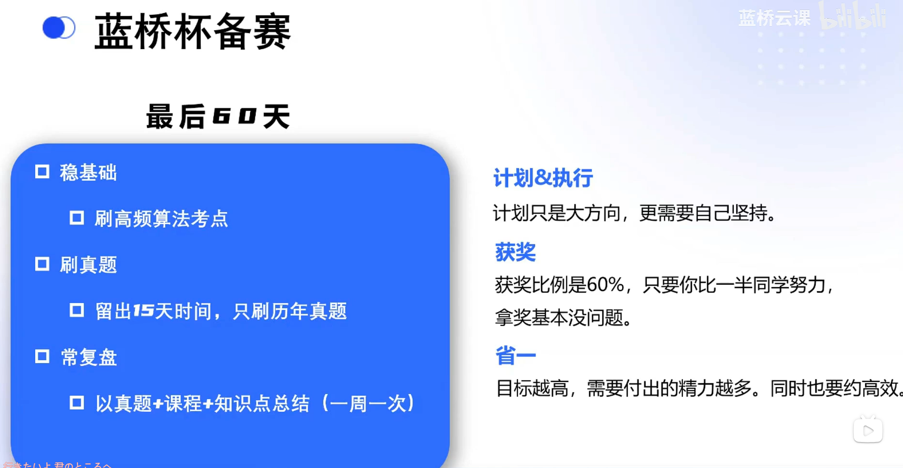

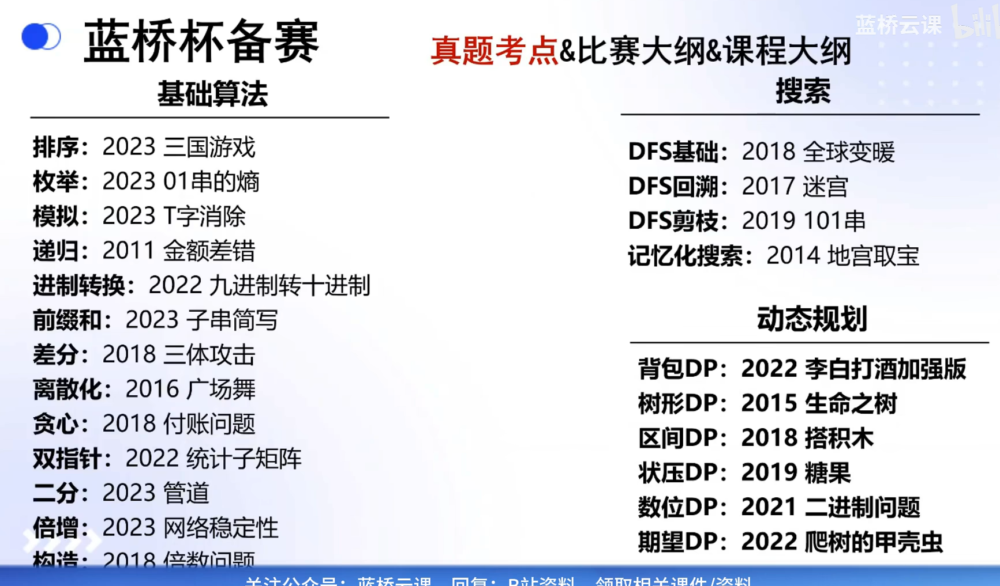

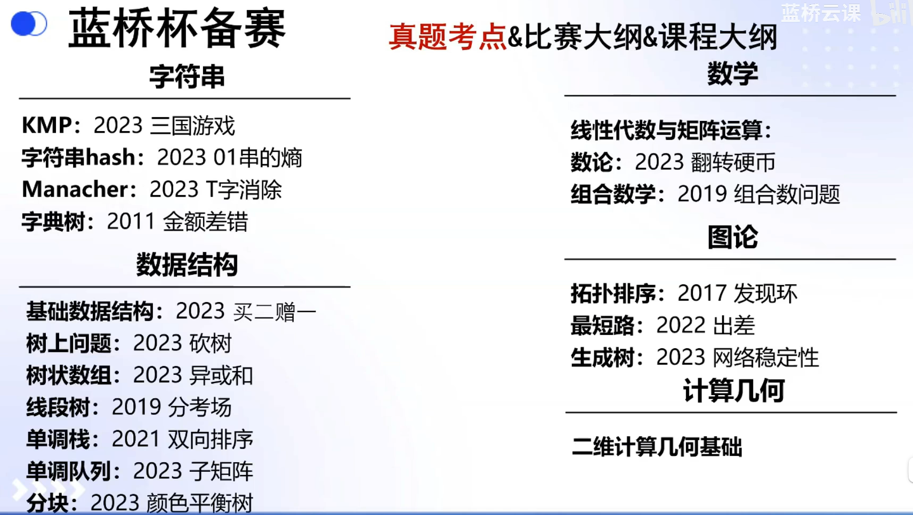

> 数论这里：就是素数和gcd考的可能性比较高

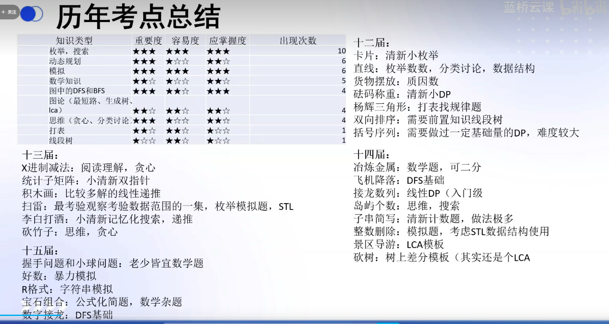

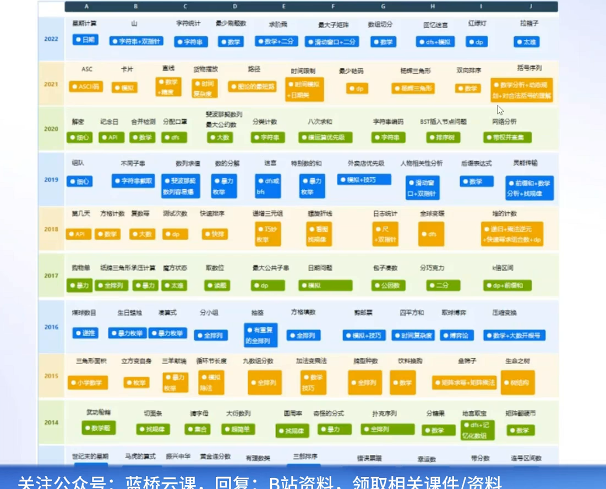


> [蓝桥杯省赛倒计时60天！想拿奖，按照这份规划来→_哔哩哔哩_bilibili](https://www.bilibili.com/video/BV1GiKGebEuN/?spm_id_from=333.788.recommend_more_video.-1&vd_source=79043f2a8efe4672df69e4818fe876b8)
>
> 看20:00，后面都是真题了，有时间再看看


#### 2

[谁懂啊！蓝桥杯“国特”的0基础冲省奖减负大招，真的超绝！_哔哩哔哩_bilibili](https://www.bilibili.com/video/BV1vuABewEXR/?spm_id_from=333.788.videopod.sections&vd_source=79043f2a8efe4672df69e4818fe876b8)


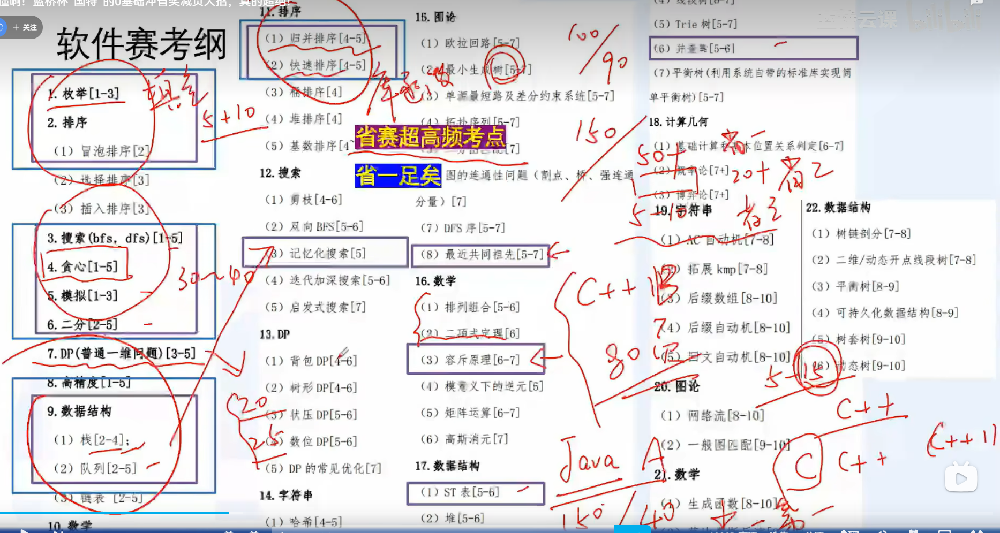

> 150分的题改到了100分
>
> **原本是10-11的题，改成了8题**
>
> 同时改了下区分度


#### 3

[16届蓝桥杯备赛公开课回放 - 【02月21日】算法｜揭秘蓝桥杯非常规题的最简解法 - 蓝桥云课](https://www.lanqiao.cn/courses/41585/learning/)

- 把必考的拿下就能够省一的


- 二分+双指针 必考

- 图论的：最短路+生成树
- 数论考点：判断质数、筛质数、什么唯一分解定理、快速幂、组合数


- 要有能判断题目难度的能力


1. 多参加OJ竞赛，最好别盲目刷题

   > 比赛状态和练习状态是不一样的
   >
   > 唉


#### ==省赛冲刺课==

> 现在都改为8道题了

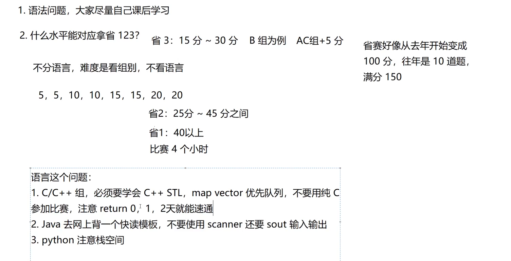

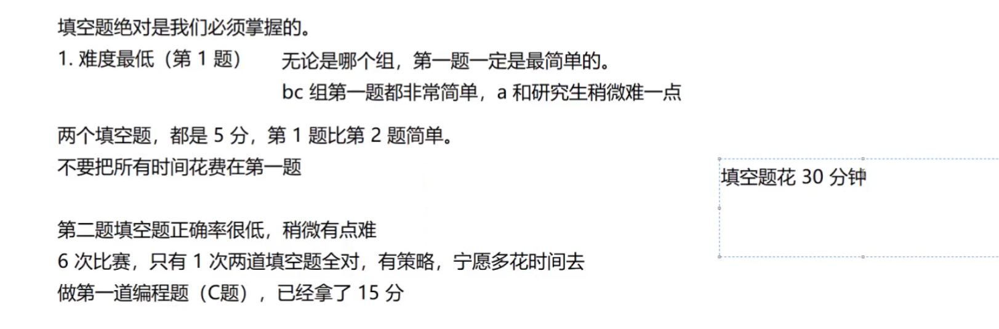

- 填空题一般就是考数学，同时难度不会很高，以及简单模拟题

  > 一般是用最最 **暴力** 的方法，有时间再用其他好点的方法，对照下答案，看是否正确
  >
  > 就是（就是模拟，不用动脑子），然后后续再用聪明的办法
  >
  > - 跑得久无所谓，**直接看后面的题**
  > - 但是最好不要无脑莽，一定要先想想有什么好且直接的做法，

- 不要去用excel，一般只有上古时期的题才能用


---

- 高精度只有c++才学，其他不用，其实也不常学
  - 觉得难背考试就用`ll`
- 题目都清楚


----

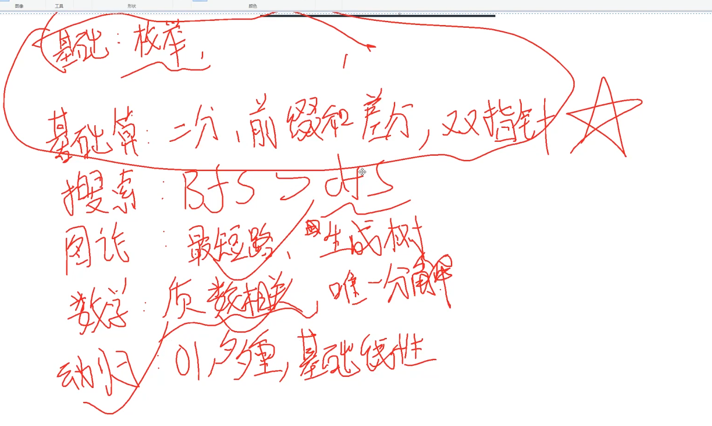


----

数论需要掌握的：


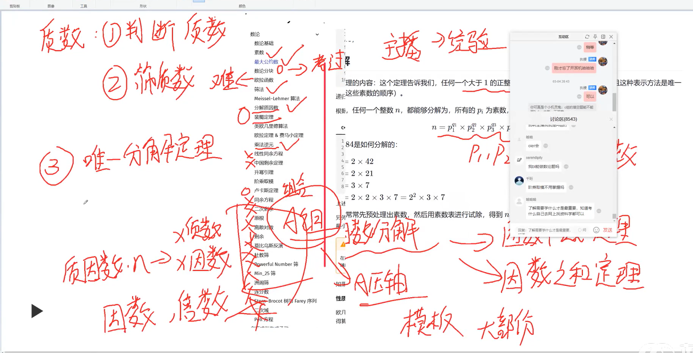

----

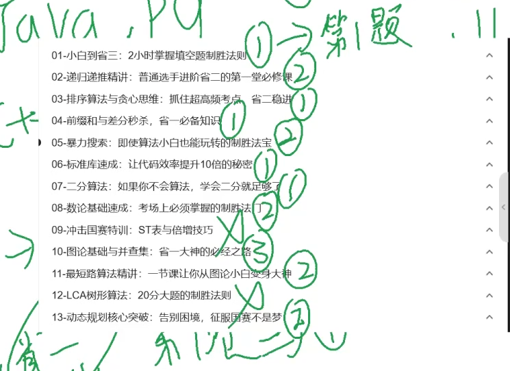


##### ==比赛流程==


- 填空题只需要填答案

- Java eclipse 代码提示设置下，字体设置下，模板设置下

- **==注意不要加`package`==**，文件名叫做`Main`

  > 比赛要结束的时候一定要检查下

> 如果实在担心可以复制多个项目
>
> 


- 调试
  - 打印
  - 出现死循环
    - 注释部分代码段
    - 限制递归次数，达到某个层数，就不断返回


- 做题策略
  - 先做第一题填空，一定就是最简单的一题，限制在20分钟以内，能够模拟就模拟
  - 第二题填空题：花五分钟判断，感觉很麻烦或者没有思路，直接跳过（性价比，较低），有百分九十的把握就开
  - 拿分重点：CDE尽量去拿满
  - F及以后：看看能不能写暴力或者骗分
  - 如果30分钟都没写出个大概没有通过样例，先跳过吧，去写后面


> 还是挺看发挥和运气


- 如果思路不确定：可以按数据范围分段，能暴力的暴力，剩下的按那个思路


#### 国赛冲刺课

[16届蓝桥杯14天国特冲刺营 - 精讲文档 - 蓝桥云课](https://www.lanqiao.cn/courses/51805/learning/?id=4071516&compatibility=false)

> 第一课将了一些方法论的东西

##### 方法论

> 个人感觉还是有点鸡肋，后续需要整理成自己能用的

##### 对拍

> 这个估计是最有价值的点
>
> 可是对于我这种根本做不完的人，可能也用不上
>
> 后面再看看


> 这里我先复制下来，其实直接看文档就行

> # 国赛导论
>
> 在进入国赛后，面对的就是有难度的算法题，一定需要完全的理解所考察的算法，才能做到：分析时有方向，做题时游刃有余。
>
> 我们将通过三部分，分别从：理解、思路、验证三个部分来说明如何以一个规范化的算法人的思维做题。
>
> ## 算法题的小习惯
>
> 在做算法题时，第一件事，就是需要理解题目，并且分析题目。
>
> 为了更好的理解题目，一定需要借助图像来进行辅助理解，同时也有利于分析题目。也就是常说的在纸上涂涂画画。其中的原因也是因为：人对图像图形的理解程度大于对抽象的文字表述。
>
> 以下给出几个例子：
>
> #### [真题-挖矿](https://www.lanqiao.cn/problems/19717/learning/?)
>
> 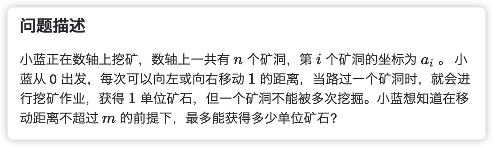
>
> 对于文字直接的阅读理解，反而不太容易清楚题目的意思。即使知道的题目的意思，但是也不太容易分析出解法。
>
> 我们直接对其进行图形处理，想象出一个画面，即小蓝在数轴上挖矿的场景，可以画出一副图形：
>
> 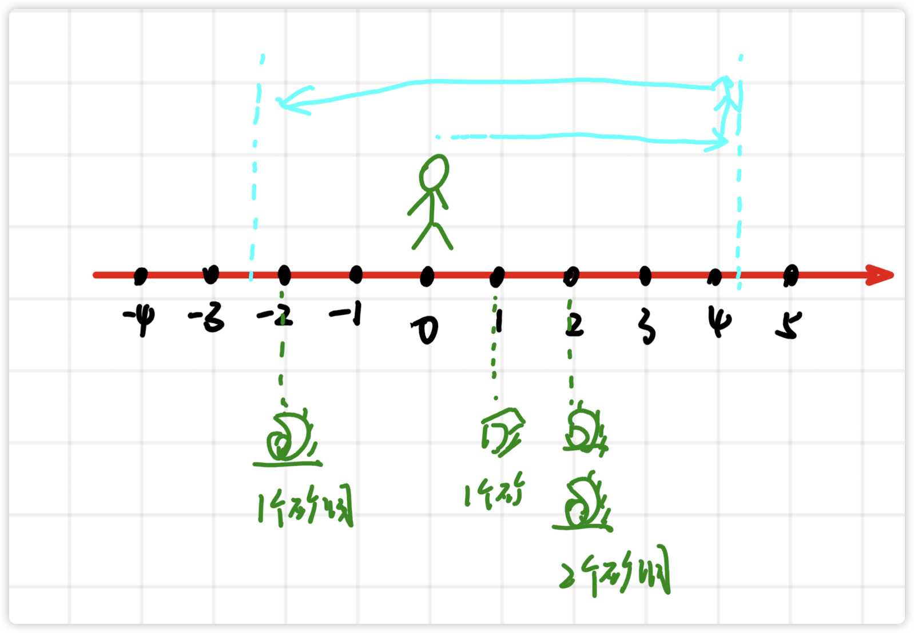
>
> 将矿洞的位置标记在数轴上，并且模拟出小蓝的行走轨迹，即可立马反应过来，挖的矿洞数量即为路线覆盖范围的矿洞数量。然后联想到前缀和。即可得到思路：
>
> 1. 将矿洞的数量标记在数轴上。
> 2. 使用前缀和记录矿洞数量。
> 3. 枚举路径，得到路线范围，计算矿洞数量，维护最大值。
>
> #### [真题-小球反弹](https://www.lanqiao.cn/problems/19732/learning/?)
>
> 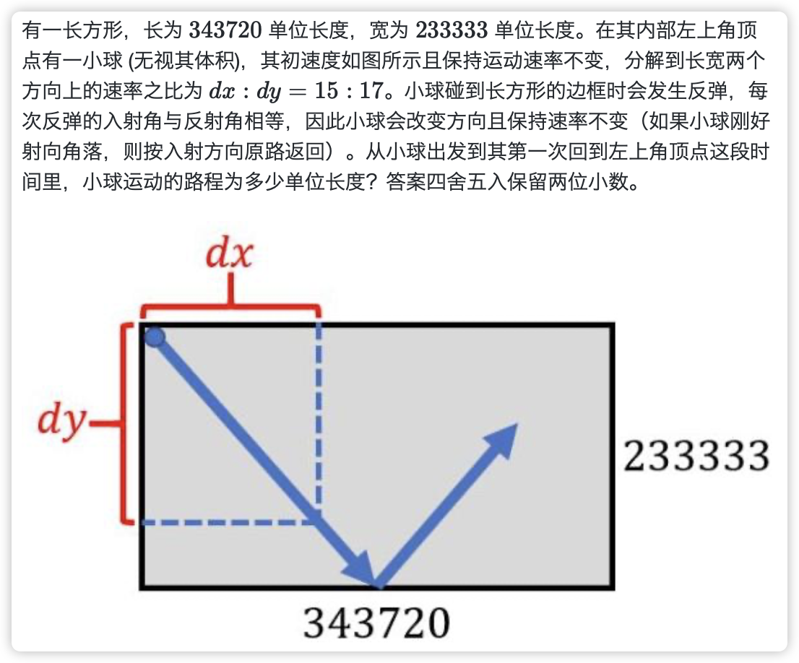
>
> 乍一看，似乎脑子里只有小球反射的过程，但是需要一些技巧，即将图形进行扩展，我们就可以将折线的反射路径转换为直线的反射路径。
>
> 具体的做法即为，对长方形进行镜像扩展，即可得到下图，在这种图形下，我们很容易找到各种线之间的比例关系。
>
> 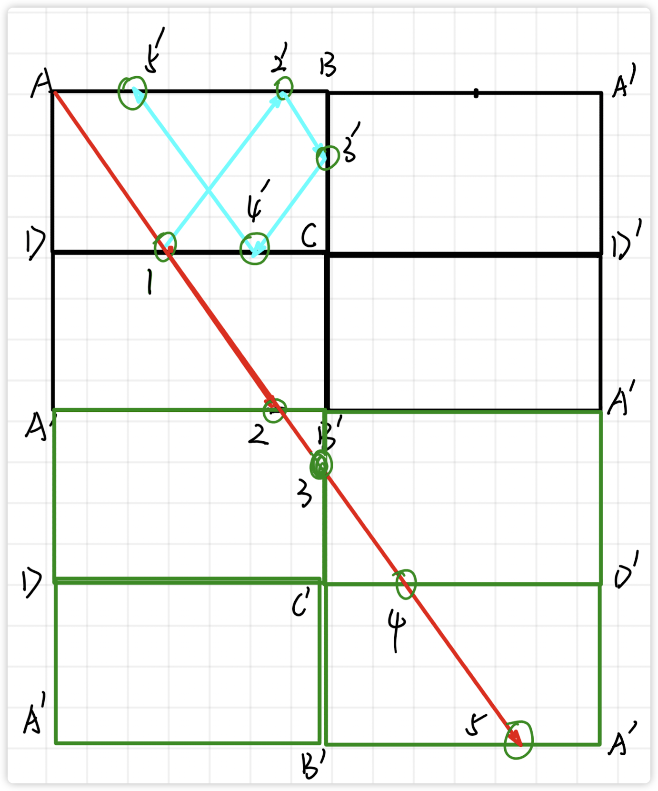
>
> 不只是做题时可以辅助理解，实际上在学习新的算法时，很多抽象的算法也能通过图形辅助理解，例如在学习拓扑排序或者并查集时，通过图形转换，可以很容易理解算法。
>
> ## 方法论
>
> 以下部分，出自《如何解题》，对做题十分的有用，通过该思维链路，能够去寻找做题的思路。
>
> 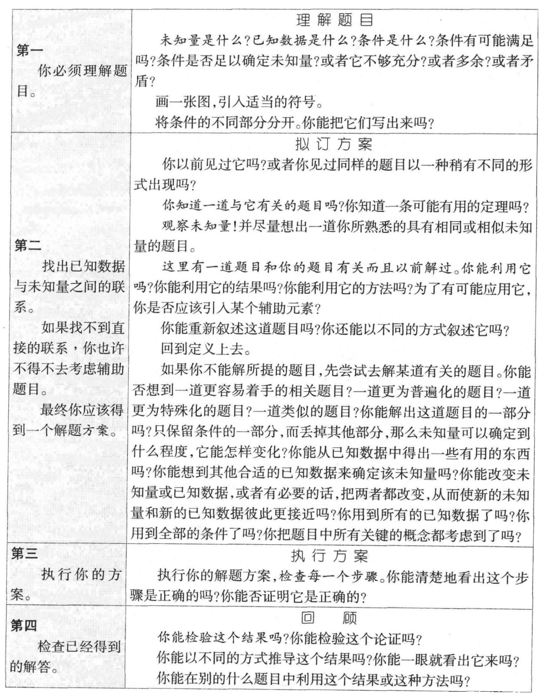
>
> ## 保分技巧-对拍
>
> #### 对拍介绍
>
> 对拍是一种验证手段。
>
> 一般来是如下几个阶段：
>
> 1. 生成数据。
> 2. 运行暴力代码，得到结果。
> 3. 运行正确代码，得到结果。
> 4. 对比两个结果。
>
> 结构流程图如下：
>
> 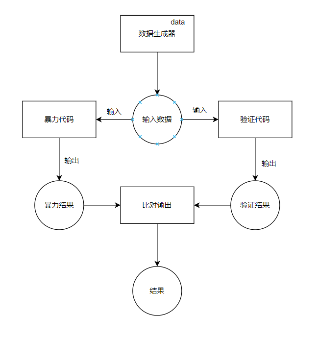
>
> 在蓝桥杯比赛中，是windows环境，所以是cmd的命令行。
>
> 我们定义如下文件：
>
> 1. `chk.cpp/py/java` 为验证代码，用该代码进行循环多组对拍。
> 2. `data.cpp/py/java` 为数据生成代码，用该代码生成题目中的验证数据。
> 3. `force.cpp/py/java` 为暴力代码，用暴力方法来完成题目。
> 4. `std.cpp/py/java` 为需要验证的代码。
>
> 我们先给出命令行解释：
>
> - C++
>
> 1. 编译： `g++ <code.cpp> -o <code.exe>`，需要替换 `<code.cpp>` 为编译的代码名称，`<code.exe>` 为编译完成的可执行文件。
> 2. 执行： `<code.exe> < <input> > <output>`，`<code.exe>` 为编译完成的可执行文件，`<input>` 为输入的文件，`<output>` 为输出的文件。
> 3. 对比：`fc <out1> <out2>`，`<out1>` 和 `<out2>` 为需要对比的两个文件。
>
> - Java
>
> 1. 编译：`javac <code.java>`，需要替换 `<code.java>` 为编译的代码名称，会自动生成 `code.class`。
> 2. 执行： `java <code> < <input> > <output>`，`<code>` 为类名，`<input>` 为输入的文件，`<output>` 为输出的文件。
> 3. 对比：`fc <out1> <out2>`，`<out1>` 和 `<out2>` 为需要对比的两个文件。
>
> - Python
>
> 1. 执行： `python <code.py> < <input> > <output>`，`<code.py>` 为编译代码，`<input>` 为输入的文件，`<output>` 为输出的文件。
> 2. 对比：`fc <out1> <out2>`，`<out1>` 和 `<out2>` 为需要对比的两个文件。
>
> #### 对拍代码
>
> 我们以一个题目为例： 求和从 a*a* 到 b*b*。
>
> 在 std 中，我们用高斯求和，在 force 中，我们用循环求和。
>
> ##### C++
>
> - std
>
> ```cpp
> #include <bits/stdc++.h>
> 
> using namespace std;
> 
> int main() {
>     int a, b;
>     cin >> a >> b;
>     cout << (a + b) * (b - a + 1) / 2 << '\n';
>     return 0;
> }
> ```
>
> - force
>
> ```cpp
> #include <bits/stdc++.h>
> 
> using namespace std;
> 
> int main() {
>     int a, b;
>     cin >> a >> b;
>     int res = 0;
>     for (int i = a; i <= b; ++i) {
>         res += i;
>     }
>     cout << res << '\n';
>     return 0;
> }
> ```
>
> - data
>
> ```cpp
> #include <bits/stdc++.h>
> 
> using namespace std;
> 
> mt19937 gen(time(0));
> 
> int main() {
>     int a, b;
>     a = gen() % 1000;
>     b = gen() % 1000;
>     if (a > b) swap(a, b);
>     cout << a << ' ' << b << '\n';
>     return 0;
> }
> ```
>
> - chk
>
> ```cpp
> #include <bits/stdc++.h>
> 
> using namespace std;
> 
> int main() {
>     int rp;
>     system("g++ data.cpp -o data.exe --std=c++11"); // 编译data文件
>     system("g++ std.cpp -o std.exe --std=c++11"); // 编译 std文件
>     system("g++ force.cpp -o force.exe --std=c++11"); // 编译force文件
> 
>     while (1) {
>         system("data.exe > input.txt"); // 生成数据，将结果存储在 input.txt中
>         system("force.exe < input.txt > fout.txt"); // 调用暴力代码，将结果存储在 fout.txt 中
>         system("std.exe < input.txt > sout.txt"); // 调用对比代码，将结果存储在 sout.txt 中
>         rp = system("fc fout.txt sout.txt"); // 进行对比
>         if (rp == 0) { // 结果比对正确
>             cout << "AC" << endl;
>         } else {
>             cout << "WA" << endl;
>             break;
>         }
>     }
>     return 0;
> }
> ```
>
> ##### Java
>
> - std
>
> ```java
> import java.util.Scanner;
> 
> public class std {
>     public static void main(String[] args) {
>         Scanner in = new Scanner(System.in);
>         int a = in.nextInt();
>         int b = in.nextInt();
>         System.out.println((a + b) * (b - a + 1) / 2);
>         in.close();
>     }
> }
> ```
>
> - force
>
> ```java
> import java.util.Scanner;
> 
> public class force {
>     public static void main(String[] args) {
>         Scanner in = new Scanner(System.in);
>         int a = in.nextInt();
>         int b = in.nextInt();
>         int res = 0;
>         for (int i = a; i <= b; ++i) res += i;
>         System.out.println(res);
>         in.close();
>     }
> }
> ```
>
> - data
>
> ```java
> import java.util.Random;
> 
> public class data {
>     public static void main(String[] args) {
>         Random random = new Random();
>         int a = random.nextInt(1000);
>         int b = random.nextInt(1000);
>         int t;
>         if (a > b) {
>             t = a; a = b; b = t;
>         }
>         System.out.println(a + " " + b);
>     }
> }
> ```
>
> - chk
>
> ```java
> public class chk {
>     public static void main(String[] args) throws Exception {
>         int rp;
>         String[] cp_data = { "cmd", "/c", "javac data.java" }; 
>         String[] cp_force = { "cmd", "/c", "javac force.java" }; 
>         String[] cp_std = { "cmd", "/c", "javac std.java" }; 
>         String[] gen_data = { "cmd", "/c", "java data > input.txt" }; 
>         String[] run_force = { "cmd", "/c", "java force < input.txt > fout.txt" }; 
>         String[] run_std = { "cmd", "/c", "java std < input.txt > sout.txt" }; 
>         String[] to_fc = { "cmd", "/c", "fc fout.txt sout.txt" }; 
> 
>         Runtime.getRuntime().exec(cp_data).waitFor(); // 
>         Runtime.getRuntime().exec(cp_force).waitFor();
>         Runtime.getRuntime().exec(cp_std).waitFor();
>         while (true) {
>             Runtime.getRuntime().exec(gen_data).waitFor();           
>             Runtime.getRuntime().exec(run_force).waitFor();
>             Runtime.getRuntime().exec(run_std).waitFor();
>             rp = Runtime.getRuntime().exec(to_fc).waitFor();
>             if (rp == 0) {
>                 System.out.println("AC");
>             } else {
>                 System.out.println("WA");
>                 break;
>             }
>         }
>     }
> }
> ```
>
> ##### Python
>
> - std
>
> ```python
> a, b = map(int, input().split())
> print((a + b) * (b - a + 1) // 2)
> ```
>
> - force
>
> ```python
> a, b = map(int, input().split())
> res = sum(range(a, b + 1, 1))
> print(res)
> ```
>
> - data
>
> ```python
> import random
> 
> def main():
>     # 生成两个0到999之间的随机数
>     a = random.randint(0, 999)
>     b = random.randint(0, 999)
> 
>     # 确保a <= b
>     if a > b:
>         a, b = b, a  # 交换a和b的值
> 
>     # 输出结果
>     print(a, b)
> 
> if __name__ == "__main__":
>     main()
> ```
>
> - chk
>
> ```python
> import os
> import sys
> 
> while True:
>     # 运行data.exe, force.exe 和 std.exe
>     os.system("python data.py > input.txt")
>     os.system("python force.py < input.txt > fout.txt")
>     os.system("python std.py < input.txt > sout.txt")
> 
>     # 对比fout.txt 和 sout.txt
>     result = os.system("fc fout.txt sout.txt")
> 
>     if result == 0:
>         print("AC")
>     else:
>         print("WA")
>         break
> ```
>
> #### 常见数据生成
>
> ##### 随机数
>
> - C++
>
> ```cpp
> #include <bits/stdc++.h>
> using namespace std;
> mt19937 gen(time(0));
> /*
>     调用gen就能生成一个随机整数。
> */
> ```
>
> - Java
>
> ```java
> import java.util.Random;
> 
> Random random = new Random();
> // 调用random.nextInt(x); 就能生成一个 [0, x] 的整数
> ```
>
> - Python
>
> ```python
> import random
> # random.randint(a, b) 生成 [a, b] 之间的整数
> ```
>
> ##### 生成一棵树
>
> 我们规定 rd(l,r)*r**d*(*l*,*r*) 为 [l,r][*l*,*r*] 之间的随机整数。
>
> 假设树的节点是 n*n*。
>
> 我们可以枚举 x*x* 从 2∼n2∼*n*，x*x* 与 rd(1,x−1)*r**d*(1,*x*−1) 建立一条边。
>
> - C++
>
> ```cpp
> #include <bits/stdc++.h>
> 
> using namespace std;
> 
> mt19937 gen(time(0));
> 
> int rd(int l, int r) { // 生成[l, r] 的随机数
>     return l + gen() % (r - l + 1);
> }
> 
> void gen_tree(int n) { // 生成一棵n个节点的树
>     for (int i = 2; i <= n; ++i) {
>         cout << i << ' ' << rd(1, i - 1) << '\n';
>     }
> }
> 
> void gen_g(int n, int m) { // 生成一个n点m边的图
>     gen_tree(n);
>     for (int i = n; i <= m; ++i) {
>         cout << rd(1, n) << ' ' << rd(1, n) << '\n';
>     }
> }
> 
> int a[1000];
> void gen_permutation(int n) { // 生成一个排列
>     for (int i = 1; i <= n; ++i) {
>         a[i] = i;
>     }
>     random_shuffle(a + 1, a + n + 1);
>     for (int i = 1; i <= n; ++i) {
>         cout << a[i] << ' ';
>     }
> }
> 
> int main() {
>     int a, b;
>     a = gen() % 10;
>     b = gen() % 10;
>     if (a > b) swap(a, b);
>     cout << a << ' ' << b << '\n';
>     return 0;
> }
> ```
>
> ##### 生成 n*n* 个不同的数。
>
> 我们定义一个集合，为当前存在的数，每生成一个数，我们都检查集合中是否存在这个数，如果不存在，加入集合，否则重新生成。
>
> ##### 生成一个连通图
>
> 先生成一棵树，然后随机多次两个点 (a,b)(*a*,*b*)，为 a,b*a*,*b* 建立一条边。
>
> ##### 让某个数以概率生成
>
> rd(1,100)*r**d*(1,100) 小于概率百分比时生成。


### 别人的

> 其实会发现大部分学的算法，都不算特别多，但是基础算法那些一定牢固，然后就是细心，接着就是运气

[蓝桥杯国一备赛心得-CSDN博客](https://blog.csdn.net/csc285650409/article/details/80488334?ops_request_misc=%7B%22request%5Fid%22%3A%22d1e9292dcfc9b0099f5d40ed6250831d%22%2C%22scm%22%3A%2220140713.130102334..%22%7D&request_id=d1e9292dcfc9b0099f5d40ed6250831d&biz_id=0&utm_medium=distribute.pc_search_result.none-task-blog-2~all~top_positive~default-1-80488334-null-null.142^v101^pc_search_result_base9&utm_term=蓝桥杯国一&spm=1018.2226.3001.4187)

- 刷题和历年真题
- 填空技巧：像求日期差之类的
- 熟练掌握了大部分基础算法：最小生成树，最短路径，动态规划，贪心算法、树啊图啊的数据结构
- 多用现成的方法
- 题感要好，看出用什么算法


[第一次参赛获Java B组国二，给蓝桥杯Beginners的6700字保姆级经验分享。_蓝桥杯java组经验贴-CSDN博客](https://blog.csdn.net/china_daniel_liu/article/details/125960060)

> 这个还要好好看看

- 善用自带的那些
- 重点掌握常考点


---


[【蓝桥杯杂谈】禁止焦虑！蓝桥杯题目是什么样的难度？你的对手大概是什么样的水平？_哔哩哔哩_bilibili](https://www.bilibili.com/video/BV1QWRVYKEGM/?spm_id_from=333.1007.tianma.1-1-1.click&vd_source=79043f2a8efe4672df69e4818fe876b8)

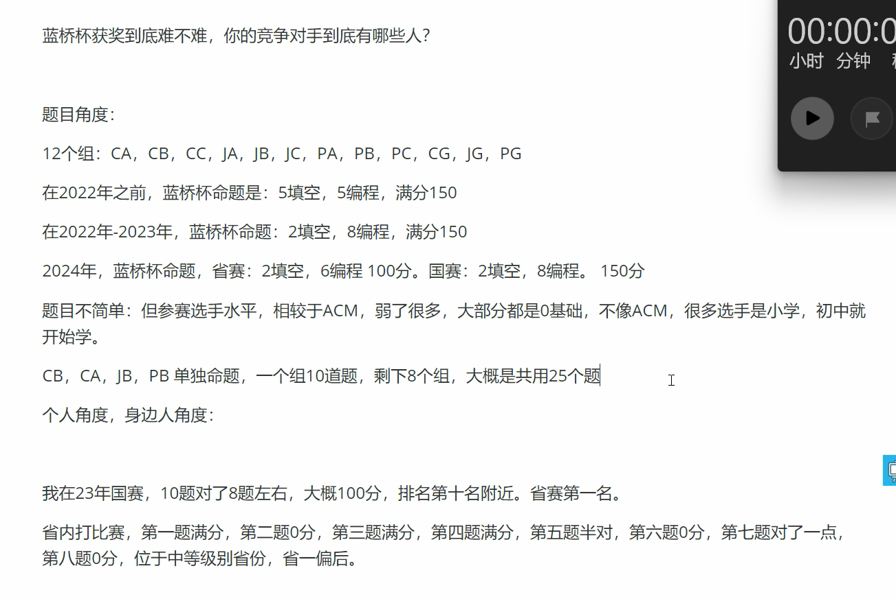

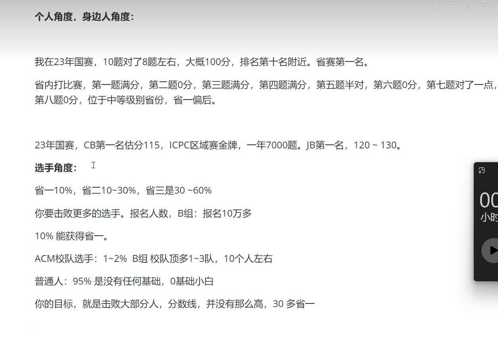


### ==TODO 官网的知识点汇总==

[‌‬‬‍‌‍‌‬‌⁠⁠⁠‌‍‌‍‬‌⁠⁠‌⁠‬‬‍‬第16届蓝桥杯省赛知识点&精炼（上册+下册） - 飞书云文档](https://lanqiaoyunke.feishu.cn/docx/CtYndWYywog18dxSfQhcm8W4nwf?view=vewuj93VM9)

> 这个还没细看
>
> 现在没有时间导出md

- 有知识点总览（包括热门知识点）
- 常考知识点
- 别人的心得
- 精选题+